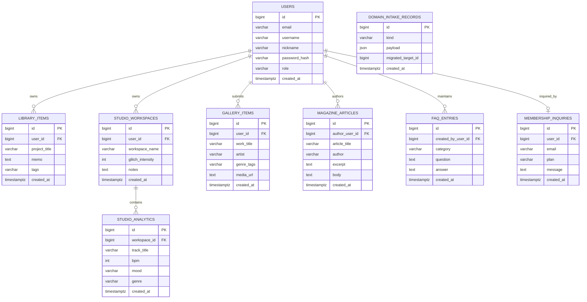

# Domain Apps ERD

`faq`, `gallery`, `library`, `magazine`, `membership`, `studioanalytics`, `studioworkspace`, `secom` 및 `domain_intake`가 사용하는 PostgreSQL 테이블 구조입니다.  
Titanic 도메인은 별도 문서 [`TITANIC_ERD.md`](./TITANIC_ERD.md)를 참고하세요.

Mermaid `erDiagram`은 속성·관계 라벨의 **따옴표·괄호·슬래시** 등에서 파싱 오류가 납니다. 필드 설명은 아래 표를 참고하세요.

## 앱 ↔ ORM ↔ 테이블

| 앱 패키지 | ORM 클래스 | 테이블 | API 경로 (예) |
|-----------|------------|--------|----------------|
| `secom` | `User` | `users` | `POST /signup`, `POST /login` (`main.py`) |
| `library` | `LibraryItem` | `library_items` | `POST /api/domain/library` |
| `studioworkspace` | `StudioWorkspace` | `studio_workspaces` | `POST /api/domain/studio/workspace` |
| `studioanalytics` | `StudioAnalytics` | `studio_analytics` | `POST /api/domain/studio/analytics` |
| `membership` | `MembershipInquiry` | `membership_inquiries` | `POST /api/domain/membership/inquiry` |
| `gallery` | `GalleryItem` | `gallery_items` | `POST /api/domain/gallery` |
| `magazine` | `MagazineArticle` | `magazine_articles` | `POST /api/domain/magazine` |
| `faq` | `FaqEntry` | `faq_entries` | `POST /api/domain/faq` |
| `domain_intake` (레거시) | `DomainIntakeRecord` | `domain_intake_records` | 마이그레이션 전용 (`db_init`) |

도메인 7종 ORM 소스는 `backend/apps/domain_intake/models/`에 있으며, `faq/app/models/` 등 앱별 `*_model.py`는 레이어 골격(스텁)입니다. 등록은 `orm_registry.import_all_models()`에서 수행합니다.

## 관계 요약

도메인 인입 데이터는 **회원 소유**와 **스튜디오 워크스페이스·분석 묶음**을 중심으로 연결합니다. `DOMAIN_INTAKE_RECORDS`는 레거시 스냅샷으로 FK를 두지 않고, 마이그레이션 시 대상 행 `id`만 `migrated_target_id`에 기록합니다.

## 관계

| 관계 | 카디널리티 | FK 컬럼 | 설명 |
|------|------------|---------|------|
| USERS → LIBRARY_ITEMS | 1:N | `library_items.user_id` → `users.id` | 마이 아카이브 프로젝트 소유 |
| USERS → STUDIO_WORKSPACES | 1:N | `studio_workspaces.user_id` → `users.id` | 비주얼 커스텀 워크스페이스 소유 |
| STUDIO_WORKSPACES → STUDIO_ANALYTICS | 1:N | `studio_analytics.workspace_id` → `studio_workspaces.id` | 워크스페이스별 오디오 분석·트랙 인입 |
| USERS → GALLERY_ITEMS | 1:N | `gallery_items.user_id` → `users.id` | 갤러리 업로드·제출자 (nullable: 비로그인 큐레이션 허용 시) |
| USERS → MAGAZINE_ARTICLES | 1:N | `magazine_articles.author_user_id` → `users.id` | 기사 작성 회원 (`author` 문자열은 표시용, nullable) |
| USERS → FAQ_ENTRIES | 1:N | `faq_entries.created_by_user_id` → `users.id` | FAQ 등록·수정 담당 (보통 `role=admin`) |
| USERS → MEMBERSHIP_INQUIRIES | 1:0..1 | `membership_inquiries.user_id` → `users.id` | 로그인 문의 시 회원 연결. 비회원은 `user_id` null, `email`만 저장 |
| DOMAIN_INTAKE_RECORDS | — | `migrated_target_id` (논리 참조) | 레거시 `kind`별 분리 테이블 행 `id`. 테이블 종류는 `kind`로 판별, DB FK 미부여 |

**참고:** `membership_inquiries.email`은 비회원 문의용이며, `user_id`가 있을 때는 `users.email`과 일치하도록 애플리케이션에서 맞춘다 (DB unique FK 아님).

## 필드 설명

### USERS (`secom.app.models.user.User`)

| 필드 | 설명 |
|------|------|
| id | 정수 PK, 자동 증가 (`ENTITY_RULE.md`) |
| email | 로그인·고유 식별, unique, indexed |
| username | 아이디, unique, indexed |
| nickname | 표시 이름 |
| password_hash | ORM 속성 `password` → DB 컬럼 `password_hash` |
| role | `user_role` enum: `admin`, `user` |
| created_at | 가입 시각 (timezone aware, server default `now()`) |

### LIBRARY_ITEMS (`library` — 마이 아카이브 인입)

| 필드 | 설명 |
|------|------|
| user_id | 소유 회원 (`users.id`, NOT NULL) |
| project_title | 프로젝트 이름 (`LibraryCreate.projectTitle`) |
| memo | 메모 (nullable) |
| tags | 태그 문자열 (nullable, max 512) |
| created_at | 저장 시각 |

### STUDIO_WORKSPACES (`studioworkspace`)

| 필드 | 설명 |
|------|------|
| user_id | 소유 회원 (`users.id`, NOT NULL) |
| workspace_name | 워크스페이스 이름 |
| glitch_intensity | 글리치 강도 0–100 (기본 42) |
| notes | 메모 (nullable) |
| created_at | 저장 시각 |

### STUDIO_ANALYTICS (`studioanalytics` — 오디오 분석 인입)

| 필드 | 설명 |
|------|------|
| workspace_id | 소속 워크스페이스 (`studio_workspaces.id`, NOT NULL) |
| track_title | 트랙 제목 |
| bpm | BPM (nullable) |
| mood | 무드 태그 (nullable) |
| genre | 장르 (nullable) |
| created_at | 저장 시각 |

### MEMBERSHIP_INQUIRIES (`membership`)

| 필드 | 설명 |
|------|------|
| user_id | 문의 회원 (`users.id`, nullable — 비회원 문의) |
| email | 문의 이메일 |
| plan | `free`, `pro`, `team` |
| message | 문의 내용 (nullable) |
| created_at | 저장 시각 |

### GALLERY_ITEMS (`gallery`)

| 필드 | 설명 |
|------|------|
| user_id | 제출 회원 (`users.id`, nullable) |
| work_title | 작품 제목 |
| artist | 아티스트명 |
| genre_tags | 장르 태그 (nullable) |
| media_url | 미디어 URL (nullable) |
| created_at | 저장 시각 |

### MAGAZINE_ARTICLES (`magazine`)

| 필드 | 설명 |
|------|------|
| author_user_id | 작성 회원 (`users.id`, nullable) |
| article_title | 기사 제목 |
| author | 작성자 |
| excerpt | 요약 (nullable) |
| body | 본문 (nullable) |
| created_at | 저장 시각 |

### FAQ_ENTRIES (`faq`)

| 필드 | 설명 |
|------|------|
| created_by_user_id | 등록·수정 회원 (`users.id`, nullable — 시드·마이그레이션 데이터) |
| category | FAQ 분류 (nullable) |
| question | 질문 |
| answer | 답변 |
| created_at | 저장 시각 |

### DOMAIN_INTAKE_RECORDS (레거시)

| 필드 | 설명 |
|------|------|
| kind | 도메인 종류 문자열 (예: `library.item`, `faq.entry`) |
| payload | 제출 JSON 본문 |
| migrated_target_id | `migrate_legacy_domain_intake_records` 이후 대상 테이블 행 `id` (nullable, FK 없음) |
| created_at | 저장 시각 |

`secom.app.db_init.init_secom_tables()` 실행 시 `domain_intake.db_init.migrate_legacy_domain_intake_records`가 레거시 행을 위 도메인별 테이블로 이전할 수 있습니다.

## 초기화·등록

| 항목 | 경로 |
|------|------|
| ORM 일괄 import | `backend/apps/orm_registry.py` |
| 테이블 create_all | `database.init_db()` ← `secom.app.db_init.init_secom_tables()` |
| DTO (요청 본문) | `backend/apps/domain_intake/schemas.py` |
| 인입 API 라우터 | `backend/apps/domain_intake/router.py` |

## 참고

- PK 규칙: `docs/DevOps/Backend/ENTITY_RULE.md`
- 백엔드 레이어·DB 규칙: `docs/DevOps/Backend/BACKEND_RULES.md`
