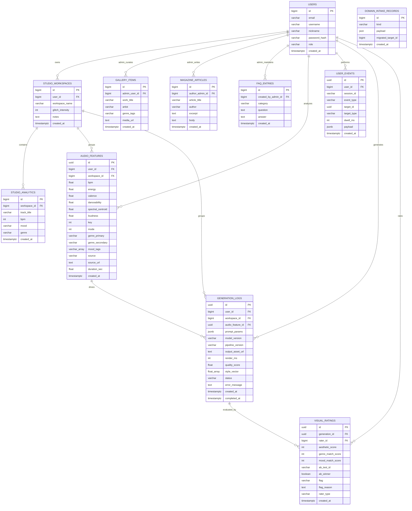

# Domain Apps ERD - MVP 정규화 전략

이 문서는 `secom`, `domain_intake`, `ml_data` 및 도메인 앱들이 사용하는 DB 구조를 **MVP 기준**으로 설명한다.  
목표는 모든 컬럼을 완전 3NF로 쪼개는 것이 아니라, 현재 서비스 검증에 필요한 핵심 관계를 안정적으로 유지하면서 빠르게 개발 가능한 구조를 잡는 것이다.

Titanic 도메인은 별도 문서 [`TITANIC_ERD.md`](./TITANIC_ERD.md)를 참고한다.  
ML 파이프라인 작업지시서는 [`../../TASK_ML_DB_SETUP.md`](../../TASK_ML_DB_SETUP.md)를 참고한다.

## MVP 기준 결론

현재 프로젝트 구조는 MVP 단계에서 **크게 바꿀 필요 없다.**

이유는 다음과 같다.

| 판단 | 설명 |
|------|------|
| 핵심 엔티티는 분리되어 있음 | `users`, `studio_workspaces`, `audio_features`, `generation_logs`, `visual_ratings`가 각각 독립 테이블로 존재한다. |
| 핵심 관계는 FK로 표현 가능 | `user_id`, `workspace_id`, `audio_feature_id`, `generation_id`로 주요 흐름을 추적할 수 있다. |
| 관리자 콘텐츠는 `users`의 admin role로 관리 | `gallery`, `magazine`, `faq`는 일반 사용자가 아니라 `users.role = "admin"`인 계정이 등록·수정한다. |
| 태그·프롬프트·이벤트 payload는 MVP에서 자주 바뀜 | 초기에 별도 테이블로 과도하게 분리하면 개발 속도와 마이그레이션 부담이 커진다. |
| ML/로그 데이터는 유연성이 중요 | 학습 데이터와 이벤트 로그는 JSON/배열 구조가 실용적인 경우가 많다. |

따라서 MVP에서는 아래 원칙을 따른다.

> 핵심 도메인 관계는 FK로 정규화하고, 빠르게 변하는 태그·무드·프롬프트·이벤트 상세값은 문자열/배열/JSON으로 허용한다.  
> 추후 검색, 추천, 통계, 관리자 필터링 요구가 커지면 해당 컬럼을 별도 테이블로 분리한다.

## 정규화 수준

| 영역 | MVP 처리 | 향후 3NF 확장 |
|------|----------|---------------|
| 회원/계정 | `users` 테이블로 관리 | `role`을 `user_roles`로 분리 가능 |
| 워크스페이스 | `studio_workspaces`로 분리 | 현 구조 유지 가능 |
| 오디오 분석 | `audio_features`로 분리 | `genres`, `moods` 분리 가능 |
| 생성 기록 | `generation_logs`로 분리 | `prompt_params`, `model_version`, `status` 분리 가능 |
| 평가 | `visual_ratings`로 분리 | `rating_flags`, `rater_types` 분리 가능 |
| 이벤트 로그 | `user_events.payload` JSON 허용 | 이벤트 속성 테이블로 분리 가능 |
| 태그/장르/무드 | 문자열 또는 배열 허용 | 별도 master + join 테이블로 분리 가능 |

## 앱 ↔ ORM ↔ 테이블

| 앱 패키지 | ORM 클래스 | 테이블 | API 경로 |
|-----------|------------|--------|----------|
| `secom` | `User` | `users` | `POST /signup`, `POST /login` |
| `studioworkspace` | `StudioWorkspace` | `studio_workspaces` | 스튜디오/ML 내부 워크스페이스 |
| `studioanalytics` | `StudioAnalytics` | `studio_analytics` | `POST /api/domain/studio/analytics` |
| `gallery` | `GalleryItem` | `gallery_items` | `POST /api/domain/gallery` (admin) |
| `magazine` | `MagazineArticle` | `magazine_articles` | `POST /api/domain/magazine` (admin) |
| `faq` | `FaqEntry` | `faq_entries` | `POST /api/domain/faq` (admin) |
| `domain_intake` | `DomainIntakeRecord` | `domain_intake_records` | 레거시 인입/마이그레이션 |
| `ml_data` | `AudioFeature` | `audio_features` | `POST /api/ml/audio-features` |
| `ml_data` | `UserEvent` | `user_events` | `POST /api/ml/events` |
| `ml_data` | `GenerationLog` | `generation_logs` | `POST /api/ml/generations` |
| `ml_data` | `VisualRating` | `visual_ratings` | `POST /api/ml/ratings` |

## 핵심 데이터 흐름

MVP에서 가장 중요한 흐름은 아래와 같다.

```text
users
  ↓
studio_workspaces
  ↓
audio_features
  ↓
generation_logs
  ↓
visual_ratings
```

이 흐름만 안정적으로 유지되면, 음악 분석부터 생성 결과 평가까지 한 사용자의 작업 이력을 추적할 수 있다.

## ERD



## 관계 설명

| 관계 | 설명 |
|------|------|
| `users → studio_workspaces` | 사용자의 스튜디오 작업 공간 |
| `studio_workspaces → studio_analytics` | 워크스페이스 단위 오디오 분석 데이터 |
| `users(admin) → gallery_items` | 관리자가 큐레이션/등록한 갤러리 항목 |
| `users(admin) → magazine_articles` | 관리자가 작성/수정한 매거진 글 |
| `users(admin) → faq_entries` | 관리자가 등록/수정한 FAQ |
| `users → audio_features` | 사용자가 업로드하거나 분석한 음악 피처 |
| `studio_workspaces → audio_features` | 워크스페이스에 연결된 음악 피처 |
| `audio_features → generation_logs` | 특정 음악 분석 결과를 기반으로 한 AI 생성 기록 |
| `generation_logs → visual_ratings` | 생성된 비주얼에 대한 사용자/관리자/자동 평가 |
| `users → user_events` | 사용자의 클릭, 선택, export 등 이벤트 로그 |

## MVP에서 허용하는 비정규화

아래 항목은 엄밀한 3NF에서는 분리할 수 있지만, MVP에서는 그대로 둔다.

| 컬럼 | MVP에서 그대로 두는 이유 | 나중에 분리할 시점 |
|------|--------------------------|--------------------|
| `gallery_items.genre_tags` | 갤러리 장르 분류가 아직 고정되지 않음 | 장르별 페이지/통계가 생길 때 |
| `audio_features.mood_tags` | ML 무드 라벨이 계속 바뀔 수 있음 | 무드 기반 추천이 중요해질 때 |
| `user_events.payload` | 이벤트별 속성이 계속 달라짐 | 이벤트 분석 스키마가 고정될 때 |
| `generation_logs.prompt_params` | 프롬프트 파라미터가 실험 중임 | 프롬프트 A/B 통계가 필요할 때 |
| `generation_logs.style_vector` | 벡터는 ML 내부 표현이라 행 분리 부담이 큼 | 벡터 차원별 분석이 필요할 때 |
| `visual_ratings.flag`, `rater_type` | 값 종류가 작고 단순함 | 관리자 통계/권한 모델이 커질 때 |

## 3NF로 확장할 때의 분리 후보

MVP 이후 요구가 커지면 아래 순서로 분리한다.

1. `user_roles`
2. `genres`, `gallery_item_genres`
3. `moods`, `audio_feature_moods`
4. `event_types`, `user_event_properties`
5. `generation_statuses`, `prompt_parameters`, `generation_prompt_values`
6. `rating_flags`, `rater_types`

이 순서는 서비스에서 실제로 검색·필터·통계가 필요한 가능성이 높은 순서다.

## 제출/발표용 설명

아래 문장을 그대로 사용해도 된다.

> MVP 단계에서는 빠른 기능 검증을 위해 태그, 무드, 프롬프트 파라미터, 이벤트 payload 등 변동성이 큰 데이터는 문자열/배열/JSON으로 저장한다.  
> 대신 사용자, 워크스페이스, 음악 피처, 생성 로그, 평가 데이터는 FK로 연결하여 핵심 도메인 관계의 정규화 기반을 유지한다.  
> 추후 검색, 추천, 통계 요구가 커지면 태그·장르·무드·상태값·프롬프트 파라미터를 별도 테이블로 분리해 3NF 수준으로 확장한다.

## 실제 구현 시 주의

현재 문서는 **MVP 기준 ERD**다.  
완전한 3NF 물리 DB로 바꾸려면 아래 작업이 추가로 필요하다.

1. SQLAlchemy ORM 모델 추가/수정
2. Alembic migration 작성
3. 기존 문자열/JSON/배열 데이터를 새 테이블로 이관
4. repository/service 계층 join 로직 수정
5. API DTO와 프론트 요청/응답 수정

따라서 지금 단계에서는 프로젝트 구조를 크게 바꾸지 않고, 위 확장 후보를 기술 부채가 아니라 **MVP 이후 고도화 항목**으로 관리한다.

## 초기화·등록

| 항목 | 경로 |
|------|------|
| ORM 일괄 import | `backend/apps/orm_registry.py` |
| 도메인 DTO | `backend/apps/domain_intake/schemas.py` |
| 도메인 API | `backend/apps/domain_intake/router.py` (`/api/domain/*`) |
| ML DTO | `backend/apps/ml_data/schemas/` |
| ML API | `backend/apps/ml_data/router.py` (`/api/ml/*`) |
| Alembic (ML 현재 구현) | `backend/alembic/versions/f6af73a4f087_add_ml_data_4_layers.py` |

## 참고

- PK 규칙: `docs/DevOps/Backend/ENTITY_RULE.md`
- 백엔드 레이어·DB 규칙: `docs/DevOps/Backend/BACKEND_RULES.md`
- ML 4-Layer 작업지시서: `docs/TASK_ML_DB_SETUP.md`
