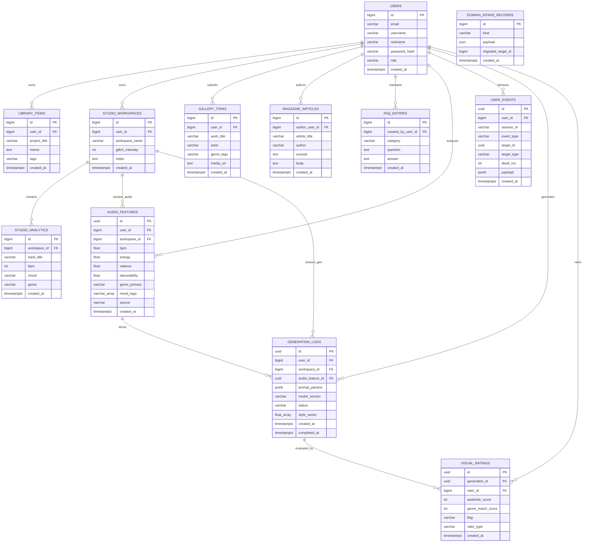

# Domain Apps ERD

`faq`, `gallery`, `library`, `magazine`, `studioanalytics`, `studioworkspace`, `secom`, `domain_intake`, **`ml_data`(ML 4-Layer)** 가 사용하는 PostgreSQL 테이블 구조입니다.  
Titanic 도메인은 별도 문서 [`TITANIC_ERD.md`](./TITANIC_ERD.md)를 참고하세요.  
ML 파이프라인 작업지시: [`../../TASK_ML_DB_SETUP.md`](../../TASK_ML_DB_SETUP.md)

Mermaid `erDiagram`은 속성·관계 라벨의 **따옴표·괄호·슬래시** 등에서 파싱 오류가 납니다. 필드 설명은 아래 표를 참고하세요.

## 앱 ↔ ORM ↔ 테이블

| 앱 패키지 | ORM 클래스 | 테이블 | API 경로 (예) |
|-----------|------------|--------|----------------|
| `secom` | `User` | `users` | `POST /signup`, `POST /login` (`main.py`) |
| `library` | `LibraryItem` | `library_items` | `POST /api/domain/library` |
| `studioworkspace` | `StudioWorkspace` | `studio_workspaces` | `POST /api/domain/studio/workspace` |
| `studioanalytics` | `StudioAnalytics` | `studio_analytics` | `POST /api/domain/studio/analytics` |
| `gallery` | `GalleryItem` | `gallery_items` | `POST /api/domain/gallery` |
| `magazine` | `MagazineArticle` | `magazine_articles` | `POST /api/domain/magazine` |
| `faq` | `FaqEntry` | `faq_entries` | `POST /api/domain/faq` |
| `domain_intake` (레거시) | `DomainIntakeRecord` | `domain_intake_records` | 마이그레이션 전용 (`db_init`) |
| `ml_data` | `AudioFeature` | `audio_features` | `POST /api/ml/audio-features` (Layer 1) |
| `ml_data` | `UserEvent` | `user_events` | `POST /api/ml/events` (Layer 2) |
| `ml_data` | `GenerationLog` | `generation_logs` | `POST /api/ml/generations` (Layer 3) |
| `ml_data` | `VisualRating` | `visual_ratings` | `POST /api/ml/ratings` (Layer 4) |

도메인 6종 ORM 소스는 `backend/apps/domain_intake/models/`에 있으며, `faq/app/models/` 등 앱별 `*_model.py`는 레이어 골격(스텁)입니다.  
**ML 4-Layer** ORM은 `backend/apps/ml_data/models/`에 있으며, `repository` → `service` → `controller` → `router` 패턴으로 `domain_intake`와 동일합니다.  
등록은 `orm_registry.import_all_models()`에서 수행합니다.

> **도메인 인입 vs ML:** `library_items` 등 마케팅 폼 테이블은 현재 ORM에 `user_id` FK가 없을 수 있습니다(아래 ERD의 `user_id`·`workspace_id`는 목표 스키마·문서 정합). **ML 테이블은 구현 완료**이며 `users.id`·`studio_workspaces.id`에 `bigint` FK, ML 행 PK는 `uuid`입니다.

## 관계 요약

도메인 인입 데이터는 **회원 소유**와 **스튜디오 워크스페이스·분석 묶음**을 중심으로 연결합니다(목표 스키마).  
**ML 4-Layer**는 에이전트 학습용 파이프라인으로, 음악 피처 → 사용자 이벤트 → 생성 로그 → 비주얼 평가 순으로 쌓입니다.  
`DOMAIN_INTAKE_RECORDS`는 레거시 스냅샷으로 FK를 두지 않고, 마이그레이션 시 대상 행 `id`만 `migrated_target_id`에 기록합니다.



## 관계

| 관계 | 카디널리티 | FK 컬럼 | 설명 |
|------|------------|---------|------|
| USERS → LIBRARY_ITEMS | 1:N | `library_items.user_id` → `users.id` | 마이 아카이브 프로젝트 소유 |
| USERS → STUDIO_WORKSPACES | 1:N | `studio_workspaces.user_id` → `users.id` | 비주얼 커스텀 워크스페이스 소유 |
| STUDIO_WORKSPACES → STUDIO_ANALYTICS | 1:N | `studio_analytics.workspace_id` → `studio_workspaces.id` | 워크스페이스별 오디오 분석·트랙 인입 |
| USERS → GALLERY_ITEMS | 1:N | `gallery_items.user_id` → `users.id` | 갤러리 업로드·제출자 (nullable: 비로그인 큐레이션 허용 시) |
| USERS → MAGAZINE_ARTICLES | 1:N | `magazine_articles.author_user_id` → `users.id` | 기사 작성 회원 (`author` 문자열은 표시용, nullable) |
| USERS → FAQ_ENTRIES | 1:N | `faq_entries.created_by_user_id` → `users.id` | FAQ 등록·수정 담당 (보통 `role=admin`) |
| DOMAIN_INTAKE_RECORDS | — | `migrated_target_id` (논리 참조) | 레거시 `kind`별 분리 테이블 행 `id`. 테이블 종류는 `kind`로 판별, DB FK 미부여 |
| USERS → AUDIO_FEATURES | 1:N | `audio_features.user_id` → `users.id` | Layer 1 음악 분석 피처 (업로드·링크 소스) |
| STUDIO_WORKSPACES → AUDIO_FEATURES | 1:N | `audio_features.workspace_id` → `studio_workspaces.id` | 워크스페이스 단위 오디오 컨텍스트 (nullable) |
| USERS → USER_EVENTS | 1:N | `user_events.user_id` → `users.id` | Layer 2 UI·행동 이벤트 |
| USERS → GENERATION_LOGS | 1:N | `generation_logs.user_id` → `users.id` | Layer 3 AI 생성 시도·결과 |
| STUDIO_WORKSPACES → GENERATION_LOGS | 1:N | `generation_logs.workspace_id` → `studio_workspaces.id` | 워크스페이스별 생성 (nullable) |
| AUDIO_FEATURES → GENERATION_LOGS | 1:N | `generation_logs.audio_feature_id` → `audio_features.id` | 분석 피처 기반 생성 (nullable) |
| GENERATION_LOGS → VISUAL_RATINGS | 1:N | `visual_ratings.generation_id` → `generation_logs.id` | Layer 4 평가·레이블 |
| USERS → VISUAL_RATINGS | 1:N | `visual_ratings.rater_id` → `users.id` | 평가자(회원·관리자·auto) |

### ML 4-Layer 파이프라인 흐름

```text
[업로드/분석] → audio_features (L1)
       ↓
[UI 행동]     → user_events (L2)     ← target_id로 generation 등 참조 가능
       ↓
[AI 렌더]     → generation_logs (L3) ← audio_feature_id 연결
       ↓
[평가/피드백] → visual_ratings (L4) ← generation_id 필수
```

API 요청 본문에 `user_id`(또는 `rater_id`)를 포함합니다. 서버 JWT 연동 전 클라이언트가 로그인 세션에서 전달합니다.

## 필드 설명

### USERS (`secom.app.models.user.User`)

| 필드 | 설명 |
|------|------|
| id | 정수 PK, 자동 증가 (`ENTITY_RULE.md`) |
| email | 로그인·고유 식별, unique, indexed |
| username | 아이디, unique, indexed |
| nickname | 표시 이름 |
| password_hash | ORM 속성 `password` → DB 컬럼 `password_hash` |
| role | `user_role` enum: `admin`, `user` |
| created_at | 가입 시각 (timezone aware, server default `now()`) |

### LIBRARY_ITEMS (`library` — 마이 아카이브 인입)

| 필드 | 설명 |
|------|------|
| user_id | 소유 회원 (`users.id`, NOT NULL) |
| project_title | 프로젝트 이름 (`LibraryCreate.projectTitle`) |
| memo | 메모 (nullable) |
| tags | 태그 문자열 (nullable, max 512) |
| created_at | 저장 시각 |

### STUDIO_WORKSPACES (`studioworkspace`)

| 필드 | 설명 |
|------|------|
| user_id | 소유 회원 (`users.id`, NOT NULL) |
| workspace_name | 워크스페이스 이름 |
| glitch_intensity | 글리치 강도 0–100 (기본 42) |
| notes | 메모 (nullable) |
| created_at | 저장 시각 |

### STUDIO_ANALYTICS (`studioanalytics` — 오디오 분석 인입)

| 필드 | 설명 |
|------|------|
| workspace_id | 소속 워크스페이스 (`studio_workspaces.id`, NOT NULL) |
| track_title | 트랙 제목 |
| bpm | BPM (nullable) |
| mood | 무드 태그 (nullable) |
| genre | 장르 (nullable) |
| created_at | 저장 시각 |

### GALLERY_ITEMS (`gallery`)

| 필드 | 설명 |
|------|------|
| user_id | 제출 회원 (`users.id`, nullable) |
| work_title | 작품 제목 |
| artist | 아티스트명 |
| genre_tags | 장르 태그 (nullable) |
| media_url | 미디어 URL (nullable) |
| created_at | 저장 시각 |

### MAGAZINE_ARTICLES (`magazine`)

| 필드 | 설명 |
|------|------|
| author_user_id | 작성 회원 (`users.id`, nullable) |
| article_title | 기사 제목 |
| author | 작성자 |
| excerpt | 요약 (nullable) |
| body | 본문 (nullable) |
| created_at | 저장 시각 |

### FAQ_ENTRIES (`faq`)

| 필드 | 설명 |
|------|------|
| created_by_user_id | 등록·수정 회원 (`users.id`, nullable — 시드·마이그레이션 데이터) |
| category | FAQ 분류 (nullable) |
| question | 질문 |
| answer | 답변 |
| created_at | 저장 시각 |

### DOMAIN_INTAKE_RECORDS (레거시)

| 필드 | 설명 |
|------|------|
| kind | 도메인 종류 문자열 (예: `library.item`, `faq.entry`) |
| payload | 제출 JSON 본문 |
| migrated_target_id | `migrate_legacy_domain_intake_records` 이후 대상 테이블 행 `id` (nullable, FK 없음) |
| created_at | 저장 시각 |

`secom.app.db_init.init_secom_tables()` 실행 시 `domain_intake.db_init.migrate_legacy_domain_intake_records`가 레거시 행을 위 도메인별 테이블로 이전할 수 있습니다.

### AUDIO_FEATURES (`ml_data` — Layer 1)

| 필드 | 설명 |
|------|------|
| id | UUID PK (`uuid4` 기본값) |
| user_id | 회원 (`users.id`, NOT NULL, indexed) |
| workspace_id | 스튜디오 워크스페이스 (`studio_workspaces.id`, nullable) |
| bpm | 템포 (nullable) |
| energy | 에너지 0.0–1.0 (nullable) |
| valence | 감정 긍정도 0.0–1.0 (nullable) |
| danceability | 댄스 가능성 0.0–1.0 (nullable) |
| spectral_centroid | 음색 밝기 (nullable) |
| loudness | dB 음량 (nullable) |
| key | 0=C … 11=B (nullable) |
| mode | 0=minor, 1=major (nullable) |
| genre_primary | 주 장르 라벨 (nullable) |
| genre_secondary | 보조 장르 (nullable) |
| mood_tags | PostgreSQL `varchar[]` 무드 태그 (nullable) |
| source | `upload` \| `spotify_link` \| `youtube_link` (기본 `upload`) |
| source_url | 원본 URL (nullable) |
| duration_sec | 길이(초) (nullable) |
| created_at | 저장 시각 |

### USER_EVENTS (`ml_data` — Layer 2)

| 필드 | 설명 |
|------|------|
| id | UUID PK |
| user_id | 회원 (`users.id`, NOT NULL, indexed) |
| session_id | 프론트 세션 ID (nullable) |
| event_type | `visual_select`, `style_edit`, `export`, `skip`, `loop_play`, `gallery_like` 등 |
| target_id | 대상 UUID (nullable, generation·gallery 등) |
| target_type | `generation`, `gallery_item` 등 (nullable) |
| dwell_ms | 체류 시간 ms (nullable) |
| payload | JSONB (편집 diff·스타일 파라미터 등, nullable) |
| created_at | 저장 시각 |

### GENERATION_LOGS (`ml_data` — Layer 3)

| 필드 | 설명 |
|------|------|
| id | UUID PK |
| user_id | 회원 (`users.id`, NOT NULL, indexed) |
| workspace_id | 워크스페이스 (`studio_workspaces.id`, nullable) |
| audio_feature_id | Layer 1 행 (`audio_features.id`, nullable) |
| prompt_params | JSONB 입력 파라미터 (genre, mood, palette 등, nullable) |
| model_version | AI 모델 버전 문자열 (nullable) |
| pipeline_version | 파이프라인 버전 (nullable) |
| output_asset_url | 생성 비주얼 URL (nullable) |
| render_ms | 렌더 소요 ms (nullable) |
| quality_score | 자동 품질 점수 (nullable) |
| style_vector | `float[]` 스타일 임베딩 (nullable) |
| status | `pending` \| `completed` \| `failed` (기본 `pending`) |
| error_message | 실패 시 메시지 (nullable) |
| created_at | 생성 시작 시각 |
| completed_at | 완료 시각 (nullable) |

### VISUAL_RATINGS (`ml_data` — Layer 4)

| 필드 | 설명 |
|------|------|
| id | UUID PK |
| generation_id | Layer 3 행 (`generation_logs.id`, NOT NULL) |
| rater_id | 평가자 (`users.id`, NOT NULL, indexed) |
| aesthetic_score | 심미성 1–5 (nullable) |
| genre_match_score | 장르 일치 1–5 (nullable) |
| mood_match_score | 무드 일치 1–5 (nullable) |
| ab_test_id | A/B 실험 ID (nullable) |
| ab_winner | A/B 승자 여부 (nullable) |
| flag | `ok` \| `inappropriate` \| `off_brand` \| `low_quality` (기본 `ok`) |
| flag_reason | 플래그 사유 (nullable) |
| rater_type | `user` \| `admin` \| `auto` (기본 `user`) |
| created_at | 저장 시각 |

## 초기화·등록

| 항목 | 경로 |
|------|------|
| ORM 일괄 import | `backend/apps/orm_registry.py` (domain_intake + ml_data 포함) |
| 테이블 create_all | `database.init_db()` ← `secom.app.db_init.init_secom_tables()` |
| 도메인 DTO | `backend/apps/domain_intake/schemas.py` |
| 도메인 API | `backend/apps/domain_intake/router.py` (`/api/domain/*`) |
| ML DTO | `backend/apps/ml_data/schemas/` |
| ML API | `backend/apps/ml_data/router.py` (`/api/ml/*`) |
| Alembic (ML) | `backend/alembic/versions/f6af73a4f087_add_ml_data_4_layers.py` |

## 참고

- PK 규칙: `docs/DevOps/Backend/ENTITY_RULE.md`
- 백엔드 레이어·DB 규칙: `docs/DevOps/Backend/BACKEND_RULES.md`
- ML 4-Layer 작업지시서: `docs/TASK_ML_DB_SETUP.md`
