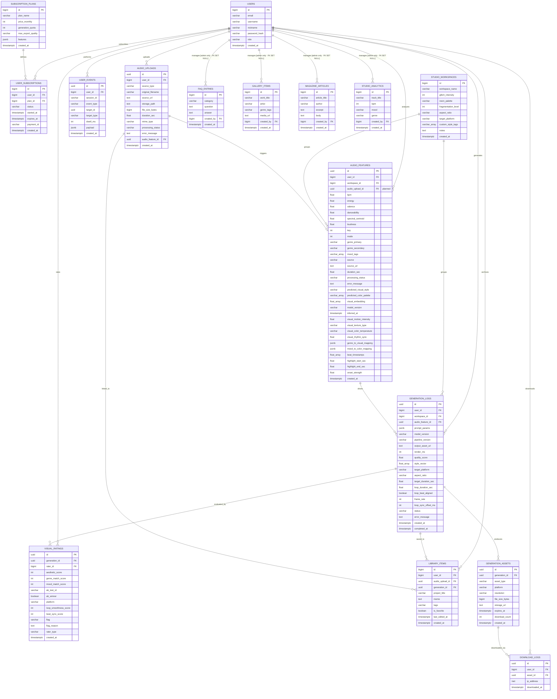

# Domain Apps ERD - MVP 정규화 전략 (v3 · admin 진짜 FK 적용)

이 문서는 `user`, `domain_intake`, `audio` 및 도메인 앱들이 사용하는 DB 구조를 **MVP 기준**으로 설명한다.  
v2의 모든 내용을 유지하면서, v2에서 소프트 FK로 처리했던 관리자 전용 콘텐츠(`faq_entries`, `gallery_items`, `magazine_articles`, `studio_analytics`)를 **진짜 DB FOREIGN KEY**로 전환했다.  
관리자 계정 삭제 시 CASCADE 정책과 Alembic 마이그레이션 추가 작업이 필요하다.

Titanic 도메인은 별도 문서 [`TITANIC_ERD.md`](./TITANIC_ERD.md)를 참고한다.  
ML 파이프라인 작업지시서(단일 소스)는 [`../../TASK_ML_DB_SETUP.md`](../../TASK_ML_DB_SETUP.md)를 참고한다.

---

## ML 4-Layer v2/v3 변경 요약 (`udio`)

[`TASK_ML_DB_SETUP.md`](../../TASK_ML_DB_SETUP.md) v3 기준. **코드·마이그레이션과 ERD는 이 절을 따라 동기화한다.**

| 구분 | 내용 |
|------|------|
| 아키텍처 | `backend/apps/audio` — `titanic` 헥사고날 (`adapter` / `app/ports` / `app/use_cases` / `dependencies`) |
| 비동기 파이프라인 | POST 즉시 `pending` 반환 → 워커가 `processing_status` / `status` 갱신 → GET `/status` 폴링 |
| 3단계 서비스 흐름 | Drop Your Sound → AI Aesthetic Analysis → Get Your Artwork |
| Layer 1 (`audio_features`) | v2: AI 추론·`processing_status` · v3: 비주얼 변환·비트 싱크·장르/무드 매핑 JSONB |
| Layer 3 (`generation_logs`) | v3: `target_platform`, 루프 메타(`loop_duration_sec`, `loop_beat_aligned`, `frame_rate` 등) |
| Layer 4 (`visual_ratings`) | v3: `platform`, `loop_smoothness_score`, `beat_sync_score` |
| 학습 추출 (v2) | 별도 테이블 없음 — `audio_features` ⋈ `generation_logs` ⋈ `visual_ratings` 3-way JOIN (`TrainingExportUseCase`) |
| 설계만 존재 (미구현 ORM) | `audio_uploads`, `generation_assets`, `download_logs` — ERD·MVP 로드맵에 포함, Alembic/ORM 추후 |

**구현 상태 (2026-06)**

| 테이블 | ORM | Alembic |
|--------|-----|---------|
| `audio_features`, `user_events`, `generation_logs`, `visual_ratings` | ✅ `udio/adapter/outbound/orm/*_orm.py` | `f6af73a4f087` + `d4e5f6a7b8c9` (v2/v3 컬럼) |
| `audio_uploads`, `generation_assets`, `download_logs` | ⏳ 미구현 | ⏳ 미구현 |

---

## v2 변경 요약

| 구분 | 내용 |
|------|------|
| 신규 테이블 (🔴 필수) | `subscription_plans`, `user_subscriptions`, `audio_uploads`, `generation_assets`, `download_logs` |
| 기존 테이블 컬럼 추가 | `library_items` → `user_id`, `audio_upload_id`, `generation_id`, `is_favorite`, `last_edited_at` 추가 |
| 기존 테이블 컬럼 추가 | `studio_workspaces` → `neon_palette`, `fragmentation_level`, `aspect_ratio`, `target_platform`, `custom_style_tags` 추가 |
| FK 관계 신규 연결 | `library_items ↔ users`, `library_items ↔ generation_logs`, `audio_uploads ↔ audio_features` |
| 관리자 전용 콘텐츠 (⚠️ v3 변경: 진짜 FK) | `faq_entries`, `gallery_items`, `magazine_articles`, `studio_analytics` → `created_by bigint FK → users(id)` 실제 DB FOREIGN KEY 제약 적용. CASCADE 정책: `SET NULL`. Alembic 마이그레이션 필요. |

---

## MVP 기준 결론

현재 프로젝트 구조는 MVP 단계에서 **핵심 관계를 안정적으로 유지하면서 빠르게 개발 가능한 구조**를 목표로 한다.

| 판단 | 설명 |
|------|------|
| 핵심 엔티티는 분리되어 있음 | `users`, `studio_workspaces`, `audio_features`, `generation_logs`, `visual_ratings`가 각각 독립 테이블로 존재한다. |
| 핵심 관계는 FK로 표현 가능 | `user_id`, `workspace_id`, `audio_feature_id`, `generation_id`로 주요 흐름을 추적할 수 있다. |
| 멤버십 플랜은 별도 테이블로 분리 | pricing 페이지가 존재하므로 `subscription_plans` + `user_subscriptions`를 MVP에서 확보한다. |
| 음원 업로드 원본은 별도 추적 | `audio_uploads` 설계(⏳). **현재** Step 1·2 상태는 `audio_features.processing_status`로 관리한다. |
| 생성 에셋은 플랫폼별 다중 파일 | Spotify Canvas·TikTok·Shorts 포맷이 다르므로 `generation_assets`로 분리한다. |
| 관리자 콘텐츠는 진짜 FK로 추적 | `gallery_items`, `magazine_articles`, `faq_entries`, `studio_analytics`에 `created_by bigint FK → users(id)` 실제 DB FOREIGN KEY를 적용한다. 관리자 삭제 시 `SET NULL` 정책으로 콘텐츠는 보존한다. |
| 태그·프롬프트·이벤트 payload는 MVP에서 자주 바뀜 | 초기에 과도하게 분리하면 개발 속도와 마이그레이션 부담이 커진다. |

따라서 MVP에서는 아래 원칙을 따른다.

> 핵심 도메인 관계는 FK로 정규화하고, 빠르게 변하는 태그·무드·프롬프트·이벤트 상세값은 문자열/배열/JSON으로 허용한다.  
> 추후 검색, 추천, 통계, 관리자 필터링 요구가 커지면 해당 컬럼을 별도 테이블로 분리한다.

---

## 정규화 수준

| 영역 | MVP 처리 | 향후 3NF 확장 |
|------|----------|---------------|
| 회원/계정 | `users` 테이블로 관리 | `role`을 `user_roles`로 분리 가능 |
| 멤버십/플랜 | `subscription_plans` + `user_subscriptions`로 분리 | 결제 이력 `payment_logs` 분리 가능 |
| 음원 업로드 | `audio_uploads`로 분리 | 업로드 청크 이력 분리 가능 |
| 워크스페이스 | `studio_workspaces`로 분리 + 커스텀 파라미터 컬럼 추가 | `palette_presets` 별도 테이블 가능 |
| 오디오 분석 | `audio_features` + `processing_status`·AI/비주얼/비트 필드 | `genres`, `moods` 분리 가능 |
| 생성 기록 | `generation_logs` + 플랫폼·루프 메타 컬럼 | `prompt_params` 실험 종료 후 정규화 |
| 생성 에셋 | `generation_assets`로 분리 | 플랫폼별 메타 테이블 분리 가능 |
| 다운로드 이력 | `download_logs`로 분리 | 플랜별 quota 집계 뷰로 확장 가능 |
| 평가 | `visual_ratings`로 분리 | `rating_flags`, `rater_types` 분리 가능 |
| 이벤트 로그 | `user_events.payload` JSON 허용 | 이벤트 속성 테이블로 분리 가능 |
| 태그/장르/무드 | 문자열 또는 배열 허용 | 별도 master + join 테이블로 분리 가능 |

---

## 앱 ↔ ORM ↔ 테이블

| 앱 패키지 | ORM 클래스 | 테이블 | 비고 |
|-----------|------------|--------|------|
| `user` | `UserRecord` | `users` | 로그인/권한(관리자) 소스 |
| `user` | `SubscriptionPlan` | `subscription_plans` | 플랜 마스터 |
| `user` | `UserSubscription` | `user_subscriptions` | 사용자별 구독 상태 |
| `domain_intake` | `StudioWorkspace` | `studio_workspaces` | 워크스페이스 그룹 + 커스텀 파라미터 |
| `domain_intake` | `StudioAnalytics` | `studio_analytics` | 트랙/장르/무드 메타 |
| `domain_intake` | `GalleryItem` | `gallery_items` | admin이 큐레이션 |
| `domain_intake` | `MagazineArticle` | `magazine_articles` | admin이 작성/수정 |
| `domain_intake` | `FaqEntry` | `faq_entries` | admin이 등록/수정 |
| `domain_intake` | `LibraryItem` | `library_items` | 마이 아카이브 (user FK 추가) |
| `udio` | `AudioFeature` | `audio_features` | ✅ `audio_feature_orm.py` — Layer 1, `processing_status`·AI 추론·비주얼/비트 필드 |
| `udio` | `UserEvent` | `user_events` | ✅ `user_event_orm.py` — Layer 2 |
| `udio` | `GenerationLog` | `generation_logs` | ✅ `generation_log_orm.py` — Layer 3, 플랫폼·루프 메타 |
| `udio` | `VisualRating` | `visual_ratings` | ✅ `visual_rating_orm.py` — Layer 4, 플랫폼별 루프 품질 점수 |
| `udio` | _(UseCase only)_ | _(JOIN)_ | ✅ `training_export_pg_repository.py` — 학습 데이터셋 추출 (테이블 없음) |
| `udio` | `AudioUpload` | `audio_uploads` | ⏳ 설계 — 원본 업로드·`processing_status` (Step 1 Drop Your Sound) |
| `udio` | `GenerationAsset` | `generation_assets` | ⏳ 설계 — 플랫폼별 생성 파일 (Step 3, `output_asset_url` 보완) |
| `udio` | `DownloadLog` | `download_logs` | ⏳ 설계 — 다운로드 이력·quota |

> ML FK: `audio_features.user_id`, `audio_features.workspace_id`(nullable), `generation_logs.audio_feature_id`(nullable), `visual_ratings.generation_id`, `visual_ratings.rater_id`.  
> `audio_features.audio_upload_id` FK는 `audio_uploads` 테이블 도입 시 추가 예정.

---

## 핵심 데이터 흐름

### ML 4-Layer (현재 구현 + 설계 로드맵)

```text
[Step 1] POST /api/ml/audio-features  →  audio_features (processing_status=pending)
              │                              ↑ 워커: inference / visual mapping / beat analysis
              │                              processing_status: pending → processing → done | failed
              │ (audio_upload_id — audio_uploads 도입 후)
              ↓
[Step 2] AI Aesthetic Analysis (백그라운드) — audio_features 컬럼 갱신
              │
              ↓
[Step 3] POST /api/ml/generations  →  generation_logs (status=pending)
              │                              ↑ 워커: update_result / update_loop_meta
              │                              status: pending → processing → completed | failed
              ↓
         generation_assets (⏳ 설계) — 플랫폼별 mp4_loop 등
              │
              ↓
         visual_ratings (POST /api/ml/ratings) — 학습 레이블 + 플랫폼별 루프 품질
              │
              ↓
         TrainingExport — 3-way JOIN → JSONL/CSV (관리자 API)

users ──→ audio_features, user_events, generation_logs, visual_ratings (user_id / rater_id FK)
studio_workspaces ──→ audio_features, generation_logs (workspace_id, nullable)
```

### 전체 도메인 (구독·아카이브·미구현 ML 보조 테이블 포함)

```text
users ──────────────────────────────────────────────────────────────────┐
  │ (user_id)                                                            │
  ↓                                                                      │
user_subscriptions ──→ subscription_plans                               │
  │                                                                      │
audio_uploads (⏳)                                                       │
  │ (audio_upload_id, optional)                                          │
  ↓                                                                      │
audio_features ───────────────────────────────────────────────────────  │
  │ (audio_feature_id, optional)                                         │
  ↓                                                                      │
generation_logs ──────────────────────────────────────────────────────  │
  │ (generation_id)                          ↑ rater_id                  │
  ↓                                          │                           │
generation_assets (⏳)                   visual_ratings ←───────────────┘
  │ (asset_id)
  ↓
download_logs (⏳)

studio_workspaces → (workspace_id, nullable) → audio_features
studio_workspaces → (workspace_id, nullable) → generation_logs

library_items → (user_id FK, generation_id FK 추가됨)
```

---

## ERD



---

## 관계 설명

### 기존 관계 (v1 유지)

| 관계 | 설명 |
|------|------|
| `users → audio_features` | `audio_features.user_id` FK |
| `users → user_events` | `user_events.user_id` FK |
| `users → generation_logs` | `generation_logs.user_id` FK |
| `users → visual_ratings` | `visual_ratings.rater_id` FK |
| `studio_workspaces → audio_features` | `audio_features.workspace_id` FK (nullable) |
| `studio_workspaces → generation_logs` | `generation_logs.workspace_id` FK (nullable) |
| `audio_features → generation_logs` | `generation_logs.audio_feature_id` FK (nullable) |
| `generation_logs → visual_ratings` | `visual_ratings.generation_id` FK |

### ML 4-Layer 학습 추출 (v2, 테이블 없음)

| 관계 | 설명 |
|------|------|
| `audio_features ⋈ generation_logs ⋈ visual_ratings` | `TrainingExportPgRepository` — `processing_status=done`, `status=completed`, `aesthetic_score >= N` 필터 후 `TrainingRecord` 반환 |

### 신규 관계 (v2 추가 · 일부 미구현)

| 관계 | 설명 |
|------|------|
| `users → user_subscriptions` | `user_subscriptions.user_id` FK |
| `subscription_plans → user_subscriptions` | `user_subscriptions.plan_id` FK |
| `users → audio_uploads` | `audio_uploads.user_id` FK ⏳ |
| `audio_uploads → audio_features` | `audio_features.audio_upload_id` FK (nullable) ⏳ |
| `generation_logs → generation_assets` | `generation_assets.generation_id` FK ⏳ |
| `generation_assets → download_logs` | `download_logs.asset_id` FK ⏳ |
| `users → download_logs` | `download_logs.user_id` FK ⏳ |
| `users → library_items` | `library_items.user_id` FK |
| `audio_uploads → library_items` | `library_items.audio_upload_id` FK (nullable) |
| `generation_logs → library_items` | `library_items.generation_id` FK (nullable) |

### 관리자 전용 콘텐츠 — 진짜 FK (v3 변경)

> `created_by bigint FK → users(id)` 실제 DB FOREIGN KEY 제약 적용.  
> 관리자 계정 삭제 시 `SET NULL` 정책으로 콘텐츠 레코드는 보존된다.  
> 쓰기 권한은 서비스 계층에서 `users.role = 'admin'`으로 추가 검증한다.

| 관계 | 컬럼 | CASCADE 정책 | 비고 |
|------|------|-------------|------|
| `users → faq_entries` | `faq_entries.created_by FK` | `SET NULL` | 관리자 삭제 시 NULL로 변경, 콘텐츠 보존 |
| `users → gallery_items` | `gallery_items.created_by FK` | `SET NULL` | 동일 |
| `users → magazine_articles` | `magazine_articles.created_by FK` | `SET NULL` | 동일 |
| `users → studio_analytics` | `studio_analytics.created_by FK` | `SET NULL` | 동일 |

**진짜 FK 적용 시 추가 작업 필요**

| 항목 | 내용 |
|------|------|
| Alembic 마이그레이션 | `created_by` 컬럼에 `ForeignKey("users.id")` + `nullable=True` 추가 |
| ORM 모델 수정 | `created_by = Column(BigInteger, ForeignKey("users.id"), nullable=True)` |
| 서비스 계층 | 생성·수정 시 `users.role == "admin"` 검증 유지 (DB FK는 role 검증 안 함) |
| 인덱스 추가 | `faq_entries.created_by`, `gallery_items.created_by` 등 인덱스 권장 |

**소프트 FK 대비 진짜 FK 장단점**

| 구분 | 진짜 FK (v3) | 소프트 FK (v2) |
|------|-------------|---------------|
| DB 정합성 | ✅ DB 레벨 보장 | ❌ 서비스에서만 보장 |
| 고아 레코드 방지 | ✅ 자동 방지 | ❌ 수동 관리 필요 |
| 관리자 삭제 처리 | SET NULL 자동 적용 | 서비스 코드에서 처리 |
| 마이그레이션 부담 | ⚠️ Alembic 작업 필요 | 없음 |
| JOIN 쿼리 | ✅ ORM relation 활용 가능 | 수동 조인 필요 |

---

## ML 4-Layer 테이블 상세 (구현 · `TASK_ML_DB_SETUP` v3)

### `audio_features` — Layer 1

| 컬럼 그룹 | 주요 컬럼 | 설명 |
|-----------|-----------|------|
| 기본 분석 | `bpm`, `energy`, `valence`, `danceability`, … | 음악 신호 특성 |
| 소스 | `source`, `source_url`, `duration_sec` | 업로드·링크 추적 |
| 비동기 | `processing_status`, `error_message`, `inferred_at` | `pending` → `processing` → `done` \| `failed` |
| AI 추론 (v2) | `predicted_visual_style`, `predicted_color_palette`, `visual_embedding`, `model_version` | 워커 `update_inference_result` |
| 화면 언어 (v3) | `visual_motion_intensity`, `visual_texture_type`, `visual_color_temperature`, `visual_rhythm_sync` | 워커 `update_visual_mapping` |
| 매핑 (v3) | `genre_to_visual_mapping`, `mood_to_color_mapping` | JSONB |
| 비트 싱크 (v3) | `beat_timestamps`, `highlight_start_sec`, `highlight_end_sec`, `onset_strength` | 워커 `update_beat_analysis` |

### `generation_logs` — Layer 3

| 컬럼 그룹 | 주요 컬럼 | 설명 |
|-----------|-----------|------|
| 입출력 | `prompt_params`, `output_asset_url`, `style_vector`, `quality_score` | 생성 입·출력 |
| 비동기 | `status`, `error_message`, `completed_at` | `pending` → `processing` → `completed` \| `failed` |
| 플랫폼 (v3) | `target_platform`, `aspect_ratio`, `target_duration_sec` | Canvas / TikTok / Shorts 등 |
| 루프 (v3) | `loop_duration_sec`, `loop_beat_aligned`, `frame_rate`, `loop_sync_offset_ms` | 워커 `update_loop_meta` |

### `visual_ratings` — Layer 4

| 컬럼 | 설명 |
|------|------|
| `aesthetic_score`, `genre_match_score`, `mood_match_score` | 지도학습 레이블 (1~5) |
| `platform`, `loop_smoothness_score`, `beat_sync_score` | 플랫폼별·루프 품질 (v3) |
| `ab_test_id`, `ab_winner` | A/B 실험 집계 |

### ML API (`/api/ml/*`)

| 레이어 | 메서드 | 경로 |
|--------|--------|------|
| Layer 1 | POST | `/audio-features` |
| Layer 1 | GET | `/audio-features/{id}`, `/audio-features/{id}/status`, `/audio-features?user_id=` |
| Layer 2 | POST, GET | `/events`, `/events?user_id=` |
| Layer 3 | POST, GET | `/generations`, `/generations/{id}`, `/generations/{id}/status`, `/generations?user_id=` |
| Layer 4 | POST, GET | `/ratings`, `/ratings/avg`, `/ratings/ab-test/{id}`, `/ratings/platform-avg` |
| Export | GET | `/export/training-set`, `/export/stats` |

> 인증: MVP는 body에 `user_id` / `rater_id` 포함. JWT 전환 계획은 `TASK_ML_DB_SETUP` §10.

---

## 신규 테이블 상세

### `subscription_plans` — 플랜 마스터

| 컬럼 | 타입 | 설명 |
|------|------|------|
| `plan_name` | varchar | `'free'`, `'pro'`, `'team'` |
| `price_monthly` | int | 월정액 (KRW 또는 USD cent) |
| `generation_quota` | int | 월 생성 횟수 제한 (`-1` = 무제한) |
| `max_export_quality` | varchar | `'1080p'`, `'4K'` |
| `features` | jsonb | 플랜별 기능 플래그 (예: `{"canvas_export": true}`) |

### `user_subscriptions` — 사용자별 구독 상태

| 컬럼 | 타입 | 설명 |
|------|------|------|
| `status` | varchar | `'active'`, `'cancelled'`, `'expired'`, `'trial'` |
| `started_at` | timestamptz | 구독 시작 시점 |
| `expires_at` | timestamptz | 만료 시점 (null = 무기한) |
| `payment_id` | varchar | Stripe 등 외부 결제 ID |

### `audio_uploads` — 음원 업로드 원본 (⏳ 설계 · ORM 미구현)

| 컬럼 | 타입 | 설명 |
|------|------|------|
| `source_type` | varchar | `'file'`, `'soundcloud'`, `'youtube'` |
| `original_filename` | varchar | 원본 파일명 (파일 업로드 시) |
| `source_url` | text | SoundCloud / YouTube URL (링크 업로드 시) |
| `storage_path` | text | S3 등 내부 저장 경로 |
| `processing_status` | varchar | `'pending'`, `'processing'`, `'done'`, `'failed'` |
| `audio_feature_id` | uuid FK | 분석 완료 후 연결 (nullable) |

> **현재 구현:** `POST /api/ml/audio-features`는 `audio_features`에 직접 insert하며 `processing_status='pending'`을 설정한다. `audio_uploads` 도입 후 Step 1은 업로드 레코드 생성 → `audio_feature_id` 연결 순으로 분리한다.

### `generation_assets` — 플랫폼별 생성 에셋 (⏳ 설계 · ORM 미구현)

> **현재 구현:** `generation_logs.output_asset_url` 및 v3 루프 메타 컬럼으로 단일 URL·메타를 저장한다. 다중 플랫폼 파일은 이 테이블 도입 후 분리한다.


| 컬럼 | 타입 | 설명 |
|------|------|------|
| `asset_type` | varchar | `'mp4_loop'`, `'gif_preview'`, `'thumbnail'` |
| `platform` | varchar | `'spotify_canvas'`, `'tiktok'`, `'shorts'`, `'universal'` |
| `resolution` | varchar | `'1080x1920'`, `'720x1280'` 등 |
| `expires_at` | timestamptz | 임시 URL 만료 시점 (null = 영구) |
| `download_count` | int | 다운로드 횟수 집계 |

### `download_logs` — 다운로드 이력 (⏳ 설계 · ORM 미구현)

| 컬럼 | 타입 | 설명 |
|------|------|------|
| `user_id` | bigint FK | 다운로드한 사용자 |
| `asset_id` | uuid FK | 다운로드한 에셋 |
| `ip_address` | inet | 요청 IP (어뷰징 감지용) |
| `downloaded_at` | timestamptz | 다운로드 시각 |

---

## 인덱스 전략 (MVP 기준)

쿼리 빈도가 높은 컬럼을 기준으로 아래 인덱스를 우선 적용한다.

| 테이블 | 인덱스 컬럼 | 이유 |
|--------|------------|------|
| `audio_uploads` | `user_id`, `processing_status`, `created_at` | 사용자별 업로드 목록, 처리 대기열 조회 |
| `audio_features` | `user_id`, `workspace_id`, `processing_status`, `created_at` | 분석 히스토리, 처리 대기열·폴링 |
| `generation_logs` | `user_id`, `status`, `target_platform`, `created_at` | 생성 이력, 상태 폴링, 플랫폼별 통계 |
| `generation_assets` | `generation_id`, `platform` | 특정 생성물의 플랫폼별 에셋 조회 |
| `user_subscriptions` | `user_id`, `status`, `expires_at` | 현재 활성 플랜 확인 |
| `download_logs` | `user_id`, `downloaded_at` | 플랜별 다운로드 quota 집계 |
| `visual_ratings` | `generation_id`, `rater_id`, `platform`, `ab_test_id` | 평가·A/B·플랫폼별 루프 품질 집계 |
| `user_events` | `user_id`, `event_type`, `created_at` | 사용자 행동 분석 |
| `library_items` | `user_id`, `is_favorite`, `last_edited_at` | 마이 아카이브 정렬/필터 |
| `faq_entries` | `created_by` | 관리자별 콘텐츠 필터 |
| `gallery_items` | `created_by` | 관리자별 콘텐츠 필터 |
| `magazine_articles` | `created_by` | 관리자별 콘텐츠 필터 |

---

## Soft Delete / FK 삭제 전략

| 테이블 | 삭제 전략 | 이유 |
|--------|-----------|------|
| `users` | soft delete (`deleted_at` 추가 권장) | 구독/결제 이력 보존 필요 |
| `audio_uploads` | soft delete | 분석 이력 추적 필요 |
| `generation_logs` | soft delete | 평가 데이터 참조 보존 |
| `generation_assets` | hard delete 가능 | 만료 URL은 실제 파일도 삭제 |
| `download_logs` | 보존 (삭제 없음) | 어뷰징 감지 / quota 집계 |
| `library_items` | hard delete 가능 | 사용자 직접 삭제 허용 |

### FK CASCADE 정책

| FK | 정책 | 설명 |
|----|------|------|
| `audio_features.user_id` | `SET NULL` | 사용자 삭제 시 분석 데이터 보존 |
| `generation_logs.user_id` | `SET NULL` | 생성 이력 보존 |
| `generation_assets.generation_id` | `CASCADE` | 생성 로그 삭제 시 에셋도 삭제 |
| `download_logs.asset_id` | `SET NULL` | 에셋 삭제 후에도 다운로드 이력 보존 |
| `user_subscriptions.user_id` | `RESTRICT` | 구독 상태 있는 사용자 삭제 방지 |
| `library_items.user_id` | `CASCADE` | 사용자 삭제 시 아카이브도 삭제 |
| `faq_entries.created_by` | `SET NULL` | 관리자 삭제 시 NULL 처리, 콘텐츠 보존 |
| `gallery_items.created_by` | `SET NULL` | 동일 |
| `magazine_articles.created_by` | `SET NULL` | 동일 |
| `studio_analytics.created_by` | `SET NULL` | 동일 |

---

## PK 규칙

| 구분 | PK 타입 | 대상 테이블 |
|------|---------|------------|
| 관리/계정 도메인 | `bigint` (auto increment) | `users`, `studio_workspaces`, `subscription_plans`, `user_subscriptions`, 콘텐츠 테이블 전체 |
| ML/이벤트/생성 도메인 | `uuid` (gen_random_uuid) | `audio_uploads`, `audio_features`, `user_events`, `generation_logs`, `generation_assets`, `download_logs`, `visual_ratings` |

> 기준: ML 파이프라인·비동기 워커에서 생성되는 레코드는 충돌 없는 `uuid`를, 관리자 UI·순번 조회가 필요한 관리 데이터는 `bigint`를 사용한다.

---

## MVP에서 허용하는 비정규화

| 컬럼 | MVP에서 그대로 두는 이유 | 나중에 분리할 시점 |
|------|--------------------------|--------------------|
| `gallery_items.genre_tags` | 갤러리 장르 분류가 아직 고정되지 않음 | 장르별 페이지/통계가 생길 때 |
| `audio_features.mood_tags` | ML 무드 라벨이 계속 바뀔 수 있음 | 무드 기반 추천이 중요해질 때 |
| `audio_features.genre_to_visual_mapping`, `mood_to_color_mapping` | v3 매핑 실험 중 | 매핑 마스터·confidence 통계 필요 시 |
| `audio_features.beat_timestamps` | 루프 싱크용 배열, 차원 가변 | 비트 마스터 테이블 분리 시 |
| `user_events.payload` | 이벤트별 속성이 계속 달라짐 | 이벤트 분석 스키마가 고정될 때 |
| `generation_logs.prompt_params` | 프롬프트 파라미터가 실험 중임 | 프롬프트 A/B 통계가 필요할 때 |
| `generation_logs.target_platform` 등 | v3에서 컬럼 분리했으나 값 집합 실험 중 | 플랫폼 마스터 테이블 도입 시 |
| `generation_logs.style_vector` | 벡터는 ML 내부 표현이라 행 분리 부담이 큼 | 벡터 차원별 분석이 필요할 때 |
| `studio_workspaces.custom_style_tags` | 스타일 태그 종류가 실험 중 | 스타일 마스터 관리가 필요할 때 |
| `subscription_plans.features` | 플랜 기능 플래그가 초기 실험 중 | 기능 플래그 관리 시스템 도입 시 |

---

## 3NF 확장 우선순위

MVP 이후 요구가 커지면 아래 순서로 분리한다.

1. `user_roles` — role 기반 권한 모델이 복잡해질 때
2. `payment_logs` — 결제 이력 추적이 필요할 때
3. `admin_content_logs` — 관리자 콘텐츠 변경 이력 감사가 필요할 때 (v3에서 진짜 FK 적용 완료, 추후 변경 이력 테이블 추가 가능)
4. `palette_presets` — 네온 팔레트 마스터 관리가 필요할 때
5. `genres`, `gallery_item_genres` — 장르 검색/필터가 생길 때
6. `moods`, `audio_feature_moods` — 무드 기반 추천이 중요해질 때
7. `event_types`, `user_event_properties` — 이벤트 분석 고도화 시
8. `generation_statuses`, `prompt_parameters` — 프롬프트 A/B 통계 시
9. `rating_flags`, `rater_types` — 평가 관리자 통계 시

---

## 초기화·등록

| 항목 | 경로 |
|------|------|
| ORM 일괄 import | `backend/apps/orm_registry.py` |
| 도메인 DTO | `backend/apps/domain_intake/schemas.py` |
| 도메인 API | `backend/apps/domain_intake/router.py` (`/api/domain/*`) |
| ML ORM | `backend/apps/audio/adapter/outbound/orm/` |
| ML DTO | `backend/apps/audio/adapter/inbound/api/schemas/` |
| ML API 라우터 | `backend/apps/audio/adapter/inbound/api/` → `udio_router` (`/api/ml/*`) |
| ML DIP | `backend/apps/audio/dependencies/` |
| `main.py` | `from udio.adapter.inbound.api import udio_router` |
| Alembic (ML 4-Layer 생성) | `backend/alembic/versions/f6af73a4f087_add_udio_4_layers.py` |
| Alembic (ML v2/v3 컬럼) | `backend/alembic/versions/d4e5f6a7b8c9_udio_v3_columns.py` |

---

## 레거시 (ERD 미포함)

예전 DB에 `domain_intake_records` 테이블(`kind` + JSON `payload`)이 남아 있으면, `backend/apps/domain_intake/db_init.py`의 `migrate_legacy_domain_intake_records()`가 `gallery_items`, `faq_entries` 등 도메인별 테이블로 **1회 이전**한다. 신규 설계·ORM·API에는 포함하지 않는다.

---

## 참고

- PK 규칙: `docs/DevOps/Backend/ENTITY_RULE.md`
- 백엔드 레이어·DB 규칙: `docs/DevOps/Backend/BACKEND_RULES.md`
- ML 4-Layer 작업지시서: `docs/TASK_ML_DB_SETUP.md`
- 보안/인증 정책: `docs/DevOps/Backend/AUTH_RULES.md`
