# Domain Apps ERD - v4 (Admin/User 완전 분리 + 3NF 적용)

이 문서는 v3에서 이어지며 아래 두 가지 목표를 달성한다.

1. **Admin / User 완전 분리** — 단일 `USERS` 테이블의 `role` 컬럼 방식에서 벗어나 `ADMINS`를 독립 엔티티로 분리한다.
2. **3NF 적용** — 이행 종속(transitive dependency) 및 다중값 컬럼(multi-valued attribute)을 식별하고, MVP 범위에서 즉시 분리 가능한 항목을 정규화한다.

관련 문서:
- Titanic 도메인: [`TITANIC_ERD.md`](./TITANIC_ERD.md)
- ML 파이프라인: [`../../TASK_ML_DB_SETUP.md`](../../TASK_ML_DB_SETUP.md)
- 이전 버전: [`DOMAIN_APPS_ERD_v3.md`](./DOMAIN_APPS_ERD_v3.md)

---

## v3 → v4 변경 요약

| 구분 | 내용 |
|------|------|
| `USERS` 변경 | `role` 컬럼 **제거**, `deleted_at` 추가 (soft delete) |
| `ADMINS` 신규 | 관리자 전용 테이블 — 별도 인증 엔드포인트 `/api/admin/auth/login` |
| 관리자 콘텐츠 FK 변경 | `created_by FK → users(id)` → `created_by FK → admins(id)` |
| `STUDIO_WORKSPACES` 변경 | `user_id FK` 추가, `custom_style_tags` 제거 (3NF) |
| `STYLE_TAGS` 신규 | 스타일 태그 마스터 테이블 |
| `WORKSPACE_STYLE_TAGS` 신규 | STUDIO_WORKSPACES ↔ STYLE_TAGS 조인 테이블 (3NF) |
| `GALLERY_ITEMS` 변경 | `genre_tags` 제거 (3NF) |
| `GENRES` 신규 | 장르 마스터 테이블 |
| `GALLERY_ITEM_GENRES` 신규 | GALLERY_ITEMS ↔ GENRES 조인 테이블 (3NF) |
| `PLATFORM_SPECS` 신규 | 플랫폼 마스터 — `platform → aspect_ratio` 이행 종속 해소 (3NF) |
| `GENERATION_LOGS` 변경 | `target_platform varchar` → `platform_id bigint FK` |
| `GENERATION_ASSETS` 변경 | `platform varchar`, `resolution varchar` → `platform_id bigint FK` |

---

## 3NF 분석

### 정규화 단계별 판정

| 단계 | 정의 | v4 판정 |
|------|------|---------|
| **1NF** | 모든 컬럼이 원자값(atomic value) | ⚠️ ML 전용 배열 컬럼 한정 허용 (근거 별도 명시) |
| **2NF** | 부분 함수 종속 없음 (복합 PK 없으면 자동 만족) | ✅ 모든 테이블 단일 PK 사용 |
| **3NF** | 이행 종속 없음 (비키 컬럼 간 종속 금지) | ✅ v4에서 `platform → aspect_ratio` 분리 완료 |

---

### 3NF 위반 항목 및 처리

#### v4에서 즉시 정규화한 항목

| 위반 | 테이블·컬럼 | 처리 방법 |
|------|------------|-----------|
| 다중값 (1NF) | `studio_workspaces.custom_style_tags` (varchar_array) | `STYLE_TAGS` + `WORKSPACE_STYLE_TAGS` 분리 |
| 다중값 (1NF) | `gallery_items.genre_tags` (varchar) | `GENRES` + `GALLERY_ITEM_GENRES` 분리 |
| 이행 종속 (3NF) | `generation_logs.target_platform → aspect_ratio` | `PLATFORM_SPECS` 마스터 테이블 분리, `platform_id FK` 로 대체 |
| 이행 종속 (3NF) | `generation_assets.platform → resolution` | `PLATFORM_SPECS` 참조, `platform_id FK` 로 대체 |
| 설계 문제 | `users.role` | `ADMINS` 테이블 분리로 해소 |

#### MVP에서 의도적으로 허용하는 1NF 예외 (ML 전용)

아래 컬럼은 PostgreSQL 네이티브 배열/JSONB 타입을 사용하며, ML 파이프라인 특성상 단일 행에 벡터·시계열·매핑 데이터를 저장하는 것이 표준 관행이다. 3NF 확장 시점은 해당 데이터를 별도로 집계·검색해야 할 때로 미룬다.

| 테이블 | 컬럼 | 타입 | 허용 근거 |
|--------|------|------|-----------|
| `audio_features` | `mood_tags` | varchar_array | ML 무드 라벨 실험 중 |
| `audio_features` | `predicted_color_palette` | varchar_array | AI 추론 출력 — 차원 가변 |
| `audio_features` | `visual_embedding` | float_array | 벡터 표현 — 행 분리 비효율 |
| `audio_features` | `beat_timestamps` | float_array | 루프 싱크용 시계열 — 분리 시 쿼리 폭증 |
| `audio_features` | `genre_to_visual_mapping` | jsonb | v3 실험 매핑 |
| `audio_features` | `mood_to_color_mapping` | jsonb | v3 실험 매핑 |
| `generation_logs` | `prompt_params` | jsonb | 프롬프트 파라미터 실험 중 |
| `generation_logs` | `style_vector` | float_array | ML 내부 표현 벡터 |
| `user_events` | `payload` | jsonb | 이벤트별 구조 상이 |
| `subscription_plans` | `features` | jsonb | 플랜 기능 플래그 실험 중 |

---

## 인증 분리 전략

| 주체 | 테이블 | 로그인 엔드포인트 | 토큰 |
|------|--------|------------------|------|
| 일반 사용자 | `USERS` | `POST /api/auth/login` | JWT (user scope) |
| 관리자 | `ADMINS` | `POST /api/admin/auth/login` | JWT (admin scope) |

> 두 토큰은 별도 시크릿 또는 별도 클레임(`sub_type: "user"` / `"admin"`)으로 구분한다.  
> 관리자 API(`/api/admin/*`) 미들웨어는 admin scope 토큰만 허용한다.

---

## 앱 ↔ ORM ↔ 테이블

| 앱 패키지 | ORM 클래스 | 테이블 | 비고 |
|-----------|------------|--------|------|
| `user` | `UserRecord` | `users` | 일반 사용자 인증 (role 제거) |
| `user` | `AdminRecord` | `admins` | 관리자 전용 인증 [NEW] |
| `user` | `SubscriptionPlan` | `subscription_plans` | 플랜 마스터 |
| `user` | `UserSubscription` | `user_subscriptions` | 사용자별 구독 상태 |
| `domain_intake` | `StudioWorkspace` | `studio_workspaces` | user_id FK 추가 |
| `domain_intake` | `StyleTag` | `style_tags` | 스타일 태그 마스터 [NEW] |
| `domain_intake` | `WorkspaceStyleTag` | `workspace_style_tags` | 조인 테이블 [NEW] |
| `domain_intake` | `StudioAnalytics` | `studio_analytics` | created_by → admins |
| `domain_intake` | `GalleryItem` | `gallery_items` | created_by → admins, genre_tags 제거 |
| `domain_intake` | `Genre` | `genres` | 장르 마스터 [NEW] |
| `domain_intake` | `GalleryItemGenre` | `gallery_item_genres` | 조인 테이블 [NEW] |
| `domain_intake` | `MagazineArticle` | `magazine_articles` | created_by → admins |
| `domain_intake` | `FaqEntry` | `faq_entries` | created_by → admins |
| `domain_intake` | `LibraryItem` | `library_items` | 변경 없음 |
| `domain_intake` | `PlatformSpec` | `platform_specs` | 플랫폼 마스터 [NEW] |
| `udio` | `AudioFeature` | `audio_features` | ✅ 변경 없음 |
| `udio` | `UserEvent` | `user_events` | ✅ 변경 없음 |
| `udio` | `GenerationLog` | `generation_logs` | ✅ target_platform → platform_id FK |
| `udio` | `VisualRating` | `visual_ratings` | ✅ 변경 없음 |
| `udio` | `AudioUpload` | `audio_uploads` | ⏳ 설계 — 변경 없음 |
| `udio` | `GenerationAsset` | `generation_assets` | ⏳ 설계 — platform → platform_id FK |
| `udio` | `DownloadLog` | `download_logs` | ⏳ 설계 — 변경 없음 |

---

## ERD

```mermaid
erDiagram
    %% ── 인증 도메인 ──────────────────────────────────────────────
    USERS ||--o{ USER_SUBSCRIPTIONS : subscribes
    SUBSCRIPTION_PLANS ||--o{ USER_SUBSCRIPTIONS : defines

    %% ── 사용자 활동 핵심 흐름 ─────────────────────────────────────
    USERS ||--o{ AUDIO_UPLOADS : uploads
    USERS ||--o{ AUDIO_FEATURES : analyzes
    USERS ||--o{ USER_EVENTS : performs
    USERS ||--o{ GENERATION_LOGS : generates
    USERS ||--o{ VISUAL_RATINGS : rates
    USERS ||--o{ LIBRARY_ITEMS : archives
    USERS ||--o{ DOWNLOAD_LOGS : downloads
    USERS ||--o{ STUDIO_WORKSPACES : owns

    %% ── 워크스페이스 ──────────────────────────────────────────────
    STUDIO_WORKSPACES ||--o{ AUDIO_FEATURES : groups
    STUDIO_WORKSPACES ||--o{ GENERATION_LOGS : groups
    STUDIO_WORKSPACES ||--o{ WORKSPACE_STYLE_TAGS : tags
    STYLE_TAGS ||--o{ WORKSPACE_STYLE_TAGS : categorizes

    %% ── 음원 → 분석 → 생성 → 에셋 → 다운로드 ────────────────────
    AUDIO_UPLOADS ||--o| AUDIO_FEATURES : triggers
    AUDIO_FEATURES ||--o{ GENERATION_LOGS : drives
    GENERATION_LOGS ||--o{ GENERATION_ASSETS : produces
    GENERATION_LOGS ||--o{ VISUAL_RATINGS : evaluated_by
    GENERATION_ASSETS ||--o{ DOWNLOAD_LOGS : downloaded_via

    %% ── 플랫폼 마스터 (3NF) ──────────────────────────────────────
    PLATFORM_SPECS ||--o{ GENERATION_LOGS : specifies
    PLATFORM_SPECS ||--o{ GENERATION_ASSETS : specifies

    %% ── 아카이브 ─────────────────────────────────────────────────
    GENERATION_LOGS ||--o{ LIBRARY_ITEMS : saved_to
    AUDIO_UPLOADS ||--o{ LIBRARY_ITEMS : linked_to

    %% ── 관리자 전용 콘텐츠 (FK → admins, SET NULL on delete) ──────
    ADMINS ||--o{ FAQ_ENTRIES : "manages [admin only · SET NULL]"
    ADMINS ||--o{ GALLERY_ITEMS : "manages [admin only · SET NULL]"
    ADMINS ||--o{ MAGAZINE_ARTICLES : "manages [admin only · SET NULL]"
    ADMINS ||--o{ STUDIO_ANALYTICS : "manages [admin only · SET NULL]"

    %% ── 장르 정규화 (3NF) ─────────────────────────────────────────
    GALLERY_ITEMS ||--o{ GALLERY_ITEM_GENRES : has
    GENRES ||--o{ GALLERY_ITEM_GENRES : classifies

    %% ════════════════════════════════════════════════════════════
    %% 테이블 컬럼 정의
    %% ════════════════════════════════════════════════════════════

    USERS {
        bigint id PK
        varchar email "UNIQUE NOT NULL"
        varchar username
        varchar nickname
        varchar password_hash
        timestamptz deleted_at "soft delete"
        timestamptz created_at
    }

    ADMINS {
        bigint id PK
        varchar email "UNIQUE NOT NULL"
        varchar username
        varchar password_hash
        timestamptz last_login_at
        timestamptz deleted_at "soft delete"
        timestamptz created_at
    }

    SUBSCRIPTION_PLANS {
        bigint id PK
        varchar plan_name
        int price_monthly
        int generation_quota
        varchar max_export_quality
        jsonb features
        timestamptz created_at
    }

    USER_SUBSCRIPTIONS {
        bigint id PK
        bigint user_id FK
        bigint plan_id FK
        varchar status
        timestamptz started_at
        timestamptz expires_at
        varchar payment_id
        timestamptz created_at
    }

    AUDIO_UPLOADS {
        uuid id PK
        bigint user_id FK
        varchar source_type
        varchar original_filename
        text source_url
        text storage_path
        bigint file_size_bytes
        float duration_sec
        varchar mime_type
        varchar processing_status
        text error_message
        uuid audio_feature_id FK
        timestamptz created_at
    }

    STUDIO_WORKSPACES {
        bigint id PK
        bigint user_id FK "v4 신규 — USERS(id)"
        varchar workspace_name
        int glitch_intensity
        varchar neon_palette
        int fragmentation_level
        varchar aspect_ratio
        text notes
        timestamptz created_at
    }

    STYLE_TAGS {
        bigint id PK
        varchar tag_name "UNIQUE NOT NULL"
        timestamptz created_at
    }

    WORKSPACE_STYLE_TAGS {
        bigint workspace_id FK
        bigint style_tag_id FK
    }

    PLATFORM_SPECS {
        bigint id PK
        varchar platform_name "UNIQUE — spotify_canvas / tiktok / shorts / universal"
        varchar default_aspect_ratio "9:16 / 1:1 등"
        varchar default_resolution "1080x1920 / 720x1280 등"
        float default_duration_sec
        timestamptz created_at
    }

    STUDIO_ANALYTICS {
        bigint id PK
        varchar track_title
        int bpm
        varchar mood
        varchar genre
        bigint created_by FK "→ admins(id)"
        timestamptz created_at
    }

    GALLERY_ITEMS {
        bigint id PK
        varchar work_title
        varchar artist
        text media_url
        bigint created_by FK "→ admins(id)"
        timestamptz created_at
    }

    GENRES {
        bigint id PK
        varchar genre_name "UNIQUE NOT NULL"
        timestamptz created_at
    }

    GALLERY_ITEM_GENRES {
        bigint gallery_item_id FK
        bigint genre_id FK
    }

    MAGAZINE_ARTICLES {
        bigint id PK
        varchar article_title
        varchar author
        text excerpt
        text body
        bigint created_by FK "→ admins(id)"
        timestamptz created_at
    }

    FAQ_ENTRIES {
        bigint id PK
        varchar category
        text question
        text answer
        bigint created_by FK "→ admins(id)"
        timestamptz created_at
    }

    LIBRARY_ITEMS {
        bigint id PK
        bigint user_id FK
        uuid audio_upload_id FK
        uuid generation_id FK
        varchar project_title
        text memo
        varchar tags
        boolean is_favorite
        timestamptz last_edited_at
        timestamptz created_at
    }

    AUDIO_FEATURES {
        uuid id PK
        bigint user_id FK
        bigint workspace_id FK
        uuid audio_upload_id FK "planned"
        float bpm
        float energy
        float valence
        float danceability
        float spectral_centroid
        float loudness
        int key
        int mode
        varchar genre_primary
        varchar genre_secondary
        varchar_array mood_tags "1NF 허용 — ML 라벨"
        varchar source
        text source_url
        float duration_sec
        varchar processing_status
        text error_message
        varchar predicted_visual_style
        varchar_array predicted_color_palette "1NF 허용 — AI 출력"
        float_array visual_embedding "1NF 허용 — 벡터"
        varchar model_version
        timestamptz inferred_at
        float visual_motion_intensity
        varchar visual_texture_type
        varchar visual_color_temperature
        float visual_rhythm_sync
        jsonb genre_to_visual_mapping "1NF 허용 — 실험 매핑"
        jsonb mood_to_color_mapping "1NF 허용 — 실험 매핑"
        float_array beat_timestamps "1NF 허용 — 시계열"
        float highlight_start_sec
        float highlight_end_sec
        float onset_strength
        timestamptz created_at
    }

    USER_EVENTS {
        uuid id PK
        bigint user_id FK
        varchar session_id
        varchar event_type
        uuid target_id
        varchar target_type
        int dwell_ms
        jsonb payload "1NF 허용 — 이벤트별 구조 상이"
        timestamptz created_at
    }

    GENERATION_LOGS {
        uuid id PK
        bigint user_id FK
        bigint workspace_id FK
        uuid audio_feature_id FK
        bigint platform_id FK "→ platform_specs(id) — v4: target_platform 대체"
        varchar aspect_ratio "nullable — 플랫폼 기본값 override 시"
        jsonb prompt_params "1NF 허용 — 파라미터 실험 중"
        varchar model_version
        varchar pipeline_version
        text output_asset_url
        int render_ms
        float quality_score
        float_array style_vector "1NF 허용 — ML 벡터"
        float target_duration_sec
        float loop_duration_sec
        boolean loop_beat_aligned
        int frame_rate
        int loop_sync_offset_ms
        varchar status
        text error_message
        timestamptz created_at
        timestamptz completed_at
    }

    GENERATION_ASSETS {
        uuid id PK
        uuid generation_id FK
        bigint platform_id FK "→ platform_specs(id) — v4: platform+resolution 대체"
        varchar resolution "nullable — 플랫폼 기본값 override 시"
        varchar asset_type
        bigint file_size_bytes
        text storage_url
        timestamptz expires_at
        int download_count
        timestamptz created_at
    }

    DOWNLOAD_LOGS {
        uuid id PK
        bigint user_id FK
        uuid asset_id FK
        inet ip_address
        timestamptz downloaded_at
    }

    VISUAL_RATINGS {
        uuid id PK
        uuid generation_id FK
        bigint rater_id FK
        int aesthetic_score
        int genre_match_score
        int mood_match_score
        varchar ab_test_id
        boolean ab_winner
        bigint platform_id FK "→ platform_specs(id) nullable"
        int loop_smoothness_score
        int beat_sync_score
        varchar flag
        text flag_reason
        varchar rater_type
        timestamptz created_at
    }
```



---

## 관계 설명

### 인증 도메인 — User / Admin 완전 분리

| 주체 | 테이블 | 관계 |
|------|--------|------|
| 일반 사용자 | `USERS` | 구독, 업로드, 생성, 라이브러리, 워크스페이스 소유 |
| 관리자 | `ADMINS` | FAQ, 갤러리, 매거진, 스튜디오 분석 콘텐츠 관리 |

> `USERS`와 `ADMINS`는 서로 FK 관계 없음 — 완전 독립 엔티티.

### 신규 관계 (v4 추가)

| 관계 | 컬럼 | 설명 |
|------|------|------|
| `users → studio_workspaces` | `studio_workspaces.user_id FK` | 워크스페이스 소유자 추적 |
| `studio_workspaces → style_tags` | `workspace_style_tags` 조인 테이블 | 스타일 태그 M:N (3NF) |
| `gallery_items → genres` | `gallery_item_genres` 조인 테이블 | 장르 M:N (3NF) |
| `platform_specs → generation_logs` | `generation_logs.platform_id FK` | 플랫폼 마스터 참조 |
| `platform_specs → generation_assets` | `generation_assets.platform_id FK` | 플랫폼 마스터 참조 |
| `platform_specs → visual_ratings` | `visual_ratings.platform_id FK` (nullable) | 플랫폼별 품질 평가 |

### 관리자 전용 콘텐츠 — FK 대상 변경 (v3 → v4)

> `created_by FK` 참조 대상: `users(id)` → `admins(id)`  
> CASCADE 정책: `SET NULL` 유지 (관리자 삭제 시 콘텐츠 보존)

| 테이블 | FK 컬럼 | 참조 대상 | CASCADE |
|--------|---------|-----------|---------|
| `faq_entries` | `created_by` | `admins(id)` | SET NULL |
| `gallery_items` | `created_by` | `admins(id)` | SET NULL |
| `magazine_articles` | `created_by` | `admins(id)` | SET NULL |
| `studio_analytics` | `created_by` | `admins(id)` | SET NULL |

### 기존 관계 (v1/v2/v3 유지)

| 관계 | 설명 |
|------|------|
| `users → audio_features` | `audio_features.user_id FK` |
| `users → user_events` | `user_events.user_id FK` |
| `users → generation_logs` | `generation_logs.user_id FK` |
| `users → visual_ratings` | `visual_ratings.rater_id FK` |
| `studio_workspaces → audio_features` | `audio_features.workspace_id FK` (nullable) |
| `studio_workspaces → generation_logs` | `generation_logs.workspace_id FK` (nullable) |
| `audio_features → generation_logs` | `generation_logs.audio_feature_id FK` (nullable) |
| `generation_logs → visual_ratings` | `visual_ratings.generation_id FK` |
| `audio_uploads → audio_features` | `audio_features.audio_upload_id FK` (nullable, ⏳) |
| `generation_logs → generation_assets` | `generation_assets.generation_id FK` (⏳) |
| `generation_assets → download_logs` | `download_logs.asset_id FK` (⏳) |

---

## 핵심 데이터 흐름

```text
[User 인증]   POST /api/auth/login        → JWT (user scope)
[Admin 인증]  POST /api/admin/auth/login  → JWT (admin scope)

[일반 사용자 흐름]
users ──→ studio_workspaces (user_id FK)
       ──→ audio_uploads (⏳) ──→ audio_features ──→ generation_logs ──→ generation_assets (⏳)
       ──→ visual_ratings (rater_id)
       ──→ library_items
       ──→ download_logs (⏳)
       ──→ user_subscriptions ──→ subscription_plans

[관리자 흐름]
admins ──→ faq_entries (created_by FK, SET NULL)
       ──→ gallery_items ──→ gallery_item_genres ──→ genres
       ──→ magazine_articles
       ──→ studio_analytics

[플랫폼 마스터]
platform_specs ──→ generation_logs (platform_id FK)
               ──→ generation_assets (platform_id FK)
               ──→ visual_ratings (platform_id FK, nullable)

[스타일 태그]
studio_workspaces ──→ workspace_style_tags ──→ style_tags
```

---

## 신규 테이블 상세

### `admins` — 관리자 전용

| 컬럼 | 타입 | 설명 |
|------|------|------|
| `id` | bigint PK | auto increment |
| `email` | varchar UNIQUE | 관리자 로그인 이메일 |
| `username` | varchar | 표시 이름 |
| `password_hash` | varchar | bcrypt 해시 |
| `last_login_at` | timestamptz | 마지막 로그인 시각 |
| `deleted_at` | timestamptz | soft delete (NULL = 활성) |
| `created_at` | timestamptz | 생성 시각 |

> 권한 세분화는 MVP에서 불필요. admin 테이블에 레코드가 있으면 관리자.

### `platform_specs` — 플랫폼 마스터 (3NF)

| 컬럼 | 타입 | 설명 |
|------|------|------|
| `id` | bigint PK | auto increment |
| `platform_name` | varchar UNIQUE | `spotify_canvas`, `tiktok`, `shorts`, `universal` |
| `default_aspect_ratio` | varchar | `9:16`, `1:1` 등 |
| `default_resolution` | varchar | `1080x1920`, `720x1280` 등 |
| `default_duration_sec` | float | 플랫폼 권장 길이 |
| `created_at` | timestamptz | 생성 시각 |

**시드 데이터 (초기 INSERT)**

| platform_name | default_aspect_ratio | default_resolution | default_duration_sec |
|---------------|----------------------|--------------------|---------------------|
| `spotify_canvas` | `9:16` | `1080x1920` | 8.0 |
| `tiktok` | `9:16` | `1080x1920` | 15.0 |
| `shorts` | `9:16` | `1080x1920` | 60.0 |
| `universal` | `1:1` | `1080x1080` | 30.0 |

### `style_tags` — 스타일 태그 마스터 (3NF)

| 컬럼 | 타입 | 설명 |
|------|------|------|
| `id` | bigint PK | auto increment |
| `tag_name` | varchar UNIQUE | 태그명 (예: `neon`, `glitch`, `minimal`) |
| `created_at` | timestamptz | 생성 시각 |

### `workspace_style_tags` — 조인 테이블 (3NF)

| 컬럼 | 타입 | 설명 |
|------|------|------|
| `workspace_id` | bigint FK → `studio_workspaces(id)` | CASCADE DELETE |
| `style_tag_id` | bigint FK → `style_tags(id)` | CASCADE DELETE |

> **PK**: `(workspace_id, style_tag_id)` 복합 PK

### `genres` — 장르 마스터 (3NF)

| 컬럼 | 타입 | 설명 |
|------|------|------|
| `id` | bigint PK | auto increment |
| `genre_name` | varchar UNIQUE | 장르명 (예: `electronic`, `hip-hop`, `ambient`) |
| `created_at` | timestamptz | 생성 시각 |

### `gallery_item_genres` — 조인 테이블 (3NF)

| 컬럼 | 타입 | 설명 |
|------|------|------|
| `gallery_item_id` | bigint FK → `gallery_items(id)` | CASCADE DELETE |
| `genre_id` | bigint FK → `genres(id)` | RESTRICT |

> **PK**: `(gallery_item_id, genre_id)` 복합 PK

---

## Alembic 마이그레이션 필요 항목 (v4)

| 순서 | 작업 | 내용 |
|------|------|------|
| 1 | CREATE TABLE `admins` | 관리자 테이블 신규 생성 |
| 2 | CREATE TABLE `platform_specs` | 플랫폼 마스터 신규 생성 + 시드 INSERT |
| 3 | CREATE TABLE `style_tags` | 스타일 태그 마스터 신규 생성 |
| 4 | CREATE TABLE `workspace_style_tags` | 조인 테이블 신규 생성 |
| 5 | CREATE TABLE `genres` | 장르 마스터 신규 생성 |
| 6 | CREATE TABLE `gallery_item_genres` | 조인 테이블 신규 생성 |
| 7 | ALTER TABLE `users` | `role` 컬럼 DROP, `deleted_at` 컬럼 ADD |
| 8 | ALTER TABLE `studio_workspaces` | `user_id bigint FK → users(id)` ADD, `custom_style_tags` DROP |
| 9 | ALTER TABLE `gallery_items` | `genre_tags` DROP |
| 10 | ALTER TABLE `faq_entries` | `created_by` FK 대상 `users` → `admins` 변경 |
| 11 | ALTER TABLE `gallery_items` | `created_by` FK 대상 `users` → `admins` 변경 |
| 12 | ALTER TABLE `magazine_articles` | `created_by` FK 대상 `users` → `admins` 변경 |
| 13 | ALTER TABLE `studio_analytics` | `created_by` FK 대상 `users` → `admins` 변경 |
| 14 | ALTER TABLE `generation_logs` | `target_platform varchar` DROP, `platform_id bigint FK` ADD (nullable) |
| 15 | ALTER TABLE `generation_assets` | `platform varchar` DROP, `resolution varchar` DROP, `platform_id bigint FK` ADD |
| 16 | ALTER TABLE `visual_ratings` | `platform varchar` DROP, `platform_id bigint FK` ADD (nullable) |

> **주의**: FK 대상 변경(10~13)은 기존 FK DROP → 신규 FK ADD 순으로 진행해야 한다.  
> `created_by` 컬럼의 기존 데이터(users.id 값)는 마이그레이션 전에 별도 처리 또는 NULL로 초기화 필요.

---

## 서비스 계층 변경 필요 항목

| 변경 전 (v3) | 변경 후 (v4) |
|-------------|-------------|
| `users.role == 'admin'` 체크 | `admins` 테이블에 레코드 존재 여부 체크 |
| JWT payload에 `role` 포함 | JWT payload에 `sub_type: "admin"` 또는 `"user"` 포함 |
| 단일 auth 미들웨어 | `user_required` / `admin_required` 미들웨어 분리 |
| `created_by` 조회 시 `users` JOIN | `created_by` 조회 시 `admins` JOIN |

---

## 인덱스 전략 (v4 업데이트)

| 테이블 | 인덱스 컬럼 | 이유 |
|--------|------------|------|
| `admins` | `email` | 로그인 조회 |
| `studio_workspaces` | `user_id`, `created_at` | 사용자별 워크스페이스 조회 |
| `workspace_style_tags` | `workspace_id`, `style_tag_id` | 복합 PK 인덱스 |
| `gallery_item_genres` | `gallery_item_id`, `genre_id` | 복합 PK 인덱스 |
| `platform_specs` | `platform_name` | 마스터 단순 조회 |
| `generation_logs` | `user_id`, `status`, `platform_id`, `created_at` | 생성 이력, 플랫폼별 통계 |
| `generation_assets` | `generation_id`, `platform_id` | 플랫폼별 에셋 조회 |
| `audio_uploads` | `user_id`, `processing_status`, `created_at` | 업로드 목록, 처리 대기열 |
| `audio_features` | `user_id`, `workspace_id`, `processing_status`, `created_at` | 분석 히스토리 |
| `user_subscriptions` | `user_id`, `status`, `expires_at` | 현재 활성 플랜 확인 |
| `download_logs` | `user_id`, `downloaded_at` | quota 집계 |
| `visual_ratings` | `generation_id`, `rater_id`, `platform_id`, `ab_test_id` | 평가·A/B 집계 |
| `user_events` | `user_id`, `event_type`, `created_at` | 사용자 행동 분석 |
| `library_items` | `user_id`, `is_favorite`, `last_edited_at` | 아카이브 정렬/필터 |
| `faq_entries` | `created_by` | 관리자별 콘텐츠 필터 |
| `gallery_items` | `created_by` | 관리자별 콘텐츠 필터 |
| `magazine_articles` | `created_by` | 관리자별 콘텐츠 필터 |

---

## Soft Delete / FK 삭제 전략 (v4 업데이트)

| 테이블 | 삭제 전략 | 이유 |
|--------|-----------|------|
| `users` | soft delete (`deleted_at`) | 구독/결제 이력 보존 |
| `admins` | soft delete (`deleted_at`) | 관리자 콘텐츠 `created_by` 추적 보존 |
| `audio_uploads` | soft delete | 분석 이력 추적 |
| `generation_logs` | soft delete | 평가 데이터 참조 보존 |
| `generation_assets` | hard delete 가능 | 만료 URL은 실제 파일도 삭제 |
| `download_logs` | 보존 (삭제 없음) | 어뷰징 감지 / quota 집계 |
| `library_items` | hard delete 가능 | 사용자 직접 삭제 허용 |
| `style_tags` | hard delete | 사용 중인 태그 삭제 시 CASCADE |
| `genres` | RESTRICT | 갤러리 아이템 참조 중이면 삭제 불가 |
| `platform_specs` | RESTRICT | 생성 로그 참조 중이면 삭제 불가 |

### FK CASCADE 정책 (v4 전체)

| FK | 정책 | 설명 |
|----|------|------|
| `users.id` → `audio_features.user_id` | SET NULL | 사용자 삭제 시 분석 데이터 보존 |
| `users.id` → `generation_logs.user_id` | SET NULL | 생성 이력 보존 |
| `users.id` → `studio_workspaces.user_id` | SET NULL | 워크스페이스 보존 |
| `users.id` → `library_items.user_id` | CASCADE | 사용자 삭제 시 아카이브도 삭제 |
| `users.id` → `user_subscriptions.user_id` | RESTRICT | 구독 있는 사용자 삭제 방지 |
| `admins.id` → `faq_entries.created_by` | SET NULL | 관리자 삭제 시 콘텐츠 보존 |
| `admins.id` → `gallery_items.created_by` | SET NULL | 동일 |
| `admins.id` → `magazine_articles.created_by` | SET NULL | 동일 |
| `admins.id` → `studio_analytics.created_by` | SET NULL | 동일 |
| `studio_workspaces.id` → `workspace_style_tags.workspace_id` | CASCADE | 워크스페이스 삭제 시 태그 연결 삭제 |
| `style_tags.id` → `workspace_style_tags.style_tag_id` | CASCADE | 태그 삭제 시 연결 삭제 |
| `gallery_items.id` → `gallery_item_genres.gallery_item_id` | CASCADE | 갤러리 아이템 삭제 시 장르 연결 삭제 |
| `genres.id` → `gallery_item_genres.genre_id` | RESTRICT | 장르 삭제 방지 (참조 중) |
| `platform_specs.id` → `generation_logs.platform_id` | RESTRICT | 플랫폼 삭제 방지 |
| `platform_specs.id` → `generation_assets.platform_id` | RESTRICT | 플랫폼 삭제 방지 |
| `generation_logs.id` → `generation_assets.generation_id` | CASCADE | 생성 로그 삭제 시 에셋도 삭제 |
| `generation_assets.id` → `download_logs.asset_id` | SET NULL | 에셋 삭제 후에도 다운로드 이력 보존 |

---

## PK 규칙 (v4 유지)

| 구분 | PK 타입 | 대상 테이블 |
|------|---------|------------|
| 관리/계정 도메인 | `bigint` (auto increment) | `users`, `admins`, `studio_workspaces`, `subscription_plans`, `user_subscriptions`, `platform_specs`, `style_tags`, `genres`, 콘텐츠 테이블 전체 |
| ML/이벤트/생성 도메인 | `uuid` (gen_random_uuid) | `audio_uploads`, `audio_features`, `user_events`, `generation_logs`, `generation_assets`, `download_logs`, `visual_ratings` |
| 조인 테이블 | 복합 PK (FK 쌍) | `workspace_style_tags`, `gallery_item_genres` |

---

## 3NF 확장 우선순위 (MVP 이후)

| 우선순위 | 항목 | 분리 시점 |
|----------|------|-----------|
| 1 | `payment_logs` | 결제 이력 추적 필요 시 |
| 2 | `admin_content_logs` | 관리자 변경 이력 감사 필요 시 |
| 3 | `moods` + `audio_feature_moods` | 무드 기반 추천 고도화 시 |
| 4 | `beat_frames` | 비트 시계열 마스터 분리 시 |
| 5 | `palette_presets` | 네온 팔레트 마스터 관리 필요 시 |
| 6 | `event_types` + `user_event_properties` | 이벤트 분석 고도화 시 |
| 7 | `prompt_parameters` | 프롬프트 A/B 통계 필요 시 |
| 8 | `rating_flags` + `rater_types` | 평가 관리자 통계 시 |

---

## 초기화·등록

| 항목 | 경로 |
|------|------|
| ORM 일괄 import | `backend/apps/orm_registry.py` |
| 도메인 DTO | `backend/apps/domain_intake/schemas.py` |
| 도메인 API | `backend/apps/domain_intake/router.py` (`/api/domain/*`) |
| Admin API | `backend/apps/admin/router.py` (`/api/admin/*`) |
| User 인증 | `backend/apps/user/auth_router.py` (`/api/auth/*`) |
| Admin 인증 | `backend/apps/user/admin_auth_router.py` (`/api/admin/auth/*`) |
| ML ORM | `backend/apps/audio/adapter/outbound/orm/` |
| ML API 라우터 | `backend/apps/audio/adapter/inbound/api/` → `udio_router` (`/api/ml/*`) |
| Alembic (v4) | `backend/alembic/versions/<hash>_erd_v4_admin_split_3nf.py` |

---

## 참고

- PK 규칙: `docs/DevOps/Backend/ENTITY_RULE.md`
- 백엔드 레이어·DB 규칙: `docs/DevOps/Backend/BACKEND_RULES.md`
- ML 4-Layer 작업지시서: `docs/TASK_ML_DB_SETUP.md`
- 보안/인증 정책: `docs/DevOps/Backend/AUTH_RULES.md`
- 이전 버전: `docs/DevOps/Backend/DOMAIN_APPS_ERD_v3.md`
