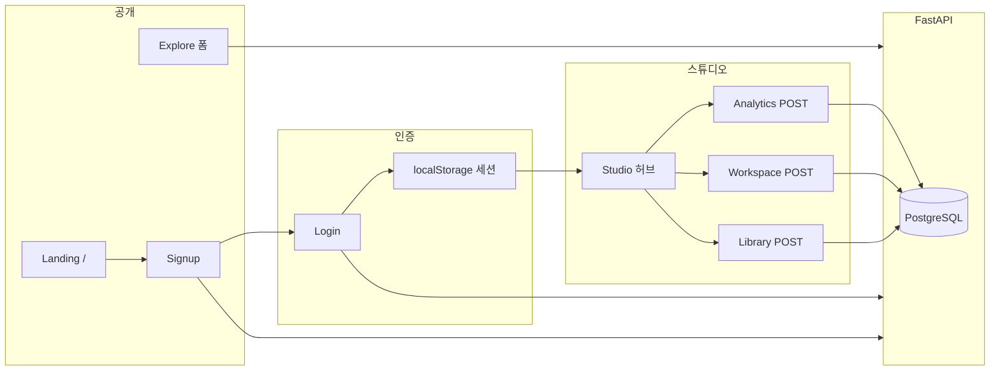

# Maestro 개발정의서

| 항목 | 내용 |
|------|------|
| 프로젝트명 | **maestro** — AI 기반 장르 미학 시각화 플랫폼 |
| 저장소 | `com.ragwatson` (모노레포: `frontend/`, `backend/`, `docs/`) |
| 문서 버전 | v1.0 |
| 작성 기준일 | 2026-05-21 |
| 상태 | **MVP·수업용 병행 개발** — 랜딩·인증·도메인 인입 API·스튜디오 허브 UI 구현, AI 렌더·결제·갤러리 목록은 미연동 |

---

## 1. 서비스 개요

### 1.1 목적

음악(또는 링크)을 업로드하면 AI가 **BPM·무드·장르** 등을 분석하고, 스포티파이 캔버스·숏폼에 맞는 **9:16 루프 비주얼**을 생성·커스터마이즈하는 상업화 플랫폼을 목표로 한다.

### 1.2 핵심 가치 제안 (현재 UI 카피)

- 랜딩 히어로: 영문 메인 `Your sound. Interpreted. Visualized.`
- 푸터: `장르를 이해하는 AI가 만드는 스포티파이·숏폼 최적화 아티스틱 비주얼.`
- 베타 운영: 등록된 베타 계정만 로그인·가입 이용 (프론트 안내 문구 기준)

### 1.3 기획 문서 참조

| 문서 | 용도 |
|------|------|
| [AI_장르미학_시각화_플랫폼_웹사이트_구조설계도.md](./AI_장르미학_시각화_플랫폼_웹사이트_구조설계도.md) | GNB·푸터·10페이지 IA |
| [페이지설명.md](./페이지설명.md) | 페이지별 역할·콘텐츠 상세 |
| [cursor_prompt_music_visual_landing.md](./cursor_prompt_music_visual_landing.md) | 랜딩 UI 프롬프트 원안 |

---

## 2. 기술 스택

| 영역 | 기술 |
|------|------|
| 프론트엔드 | **Next.js 16** (App Router, Turbopack), React, TypeScript, Tailwind CSS, Framer Motion, shadcn/ui |
| 백엔드 | **FastAPI**, Python 3.13+, SQLAlchemy 2 (async), Alembic |
| DB | **PostgreSQL** (`DATABASE_URL`, 미설정 시 DB 기능 스킵) |
| AI (실험) | Google **Gemini** (`GEMINI_API_KEY`, `/chat`) |
| ML (수업) | pandas, scikit-learn — Titanic·Doro 도메인 |
| 폰트 | Outfit, Inter, **Noto Sans KR** |
| 실행 | `frontend`: `npm run dev` · `backend`: `start-backend.ps1` (uvicorn `:8000`) |

---

## 3. 저장소 구조

```text
com.ragwatson/
├── frontend/          # Next.js 앱
├── backend/
│   ├── apps/          # FastAPI 애플리케이션 루트 (PYTHONPATH=apps)
│   ├── alembic/       # 마이그레이션 (구성됨)
│   ├── start-backend.ps1
│   └── stop-backend.ps1
├── docs/              # 기획·DevOps·본 정의서
└── CLAUDE.md, AGENTS.md  # 에이전트 코딩 지침
```

---

## 4. 백엔드 정의

### 4.1 진입점

- **파일:** `backend/apps/main.py`
- **앱 타이틀:** FastAPI `Amy Shin Main Page` (레거시 명칭)
- **라우터:** `domain_intake_router` (`/api/domain/*`)
- **시작 시:** `secom`·`titanic` 테이블 `db_init` (DATABASE_URL 있을 때)

### 4.2 도메인 모듈

| 패키지 | 역할 | 비고 |
|--------|------|------|
| **secom** | 회원 (`users`) — 회원가입·로그인 | `POST /signup`, `POST /login` |
| **domain_intake** | 도메인 폼 인입 **실제 구현** (ORM·repository·service·router) | 6종 테이블 CRUD 인입 |
| **faq, gallery, library, magazine, studioanalytics, studioworkspace** | 레이어 골격 (controller/repository 스텁) | ORM은 `domain_intake/models/`에 통합 |
| **titanic** | 타이타닉 승객 ERD·CSV·ML API | 수업용 |
| **doro** | `/doro/data` 등 | 보조 데이터셋 |
| **agora, matrix** | keymaker·Gemini 부트스트랩 | 환경·채팅 |
| **membership** | (제거됨) | DB `membership_inquiries` DROP, ORM·API 제거 |

### 4.3 공개 API 목록 (구현됨)

| 메서드 | 경로 | 설명 |
|--------|------|------|
| GET | `/`, `/health`, `/health/db`, `/db-check` | 헬스·DB 점검 |
| POST | `/chat` | Gemini 채팅 (키 없으면 503) |
| POST | `/signup` | 회원가입 |
| POST | `/login` | 로그인 (비밀번호 검증) |
| POST | `/api/domain/library` | 마이 아카이브 인입 |
| POST | `/api/domain/studio/workspace` | 스튜디오 워크스페이스 |
| POST | `/api/domain/studio/analytics` | 오디오 분석 인입 |
| POST | `/api/domain/gallery` | 갤러리 작품 |
| POST | `/api/domain/magazine` | 매거진 기사 |
| POST | `/api/domain/faq` | FAQ |
| GET | `/titanic/data`, `/count`, `/tree`, `/model` | Titanic ML·데이터 |
| GET | `/doro/data` | Doro 데이터 |

스키마: `backend/apps/domain_intake/schemas.py`, `secom/app/schemas/`

### 4.4 데이터베이스

- **ERD:** [DevOps/Backend/DOMAIN_APPS_ERD.md](./DevOps/Backend/DOMAIN_APPS_ERD.md)
- **Titanic ERD:** [DevOps/Backend/TITANIC_ERD.md](./DevOps/Backend/TITANIC_ERD.md)
- **ORM 등록:** `backend/apps/orm_registry.py` → `import_all_models()`
- **관계 요약**
  - `users` 1:N `library_items`, `studio_workspaces`, `gallery_items`, `magazine_articles`, `faq_entries`
  - `studio_workspaces` 1:N `studio_analytics`
  - `domain_intake_records`: 레거시 JSON 스냅샷 → 마이그레이션용
- **membership_inquiries:** 테이블 DROP 처리 (`domain_intake/db_init.drop_membership_inquiries_table`)

### 4.5 환경 변수 (백엔드)

| 변수 | 용도 |
|------|------|
| `DATABASE_URL` | async PostgreSQL |
| `GEMINI_API_KEY` | `/chat` |
| 기타 | `backend/.env` (keymaker.bootstrap) |

### 4.6 코딩 규칙

- [DevOps/Backend/BACKEND_RULES.md](./DevOps/Backend/BACKEND_RULES.md)
- [DevOps/Backend/ENTITY_RULE.md](./DevOps/Backend/ENTITY_RULE.md)

---

## 5. 프론트엔드 정의

### 5.1 앱 구조

- **루트 레이아웃:** `app/layout.tsx` — 전역 `SiteHeader`, `pt-20`, 다크 배경
- **메인:** `app/page.tsx` → `MusicVisualLanding` + `LandingSiteFooter`
- **BFF:** `app/api/login`, `app/api/signup`, `app/api/chat`, `app/api/weather/*` → FastAPI 또는 외부 API 프록시

### 5.2 인증 (클라이언트 세션)

| 항목 | 구현 |
|------|------|
| 저장소 | `localStorage` 키 `maestro_auth_user` |
| 훅 | `lib/auth-session.ts` — `useAuthSession`, `setAuthUser`, `clearAuthUser` |
| 로그인 후 | 헤더 **계정** 메뉴: 구독 관리, 계정 설정, 로그아웃 |
| 비로그인 | 로그인, 회원가입만 표시 |
| 서버 세션/JWT | **미구현** (베타: 클라이언트 저장만) |

### 5.3 글로벌 내비게이션 (`components/site-header.tsx`)

| 메뉴 | 하위/링크 |
|------|-----------|
| **수업용** | 타이타닉 `/titanic` |
| **서울 날씨** | `SeoulWeather` 위젯 |
| **둘러보기** | 갤러리 `/gallery`, 매거진 `/magazine` |
| **기술 소개** | `/features` |
| **멤버십** | `/pricing` |
| **FAQ** | `/faq` |
| **스튜디오로 가기** | `/studio` |
| **계정** | 로그인·회원가입 또는 구독·설정·로그아웃 |

- 투명 헤더 경로: `TRANSPARENT_NAV_PATHS` (랜딩·인증·스튜디오·법적 페이지 등)
- **제거됨:** GNB **관리자** 드롭다운 및 `/admin/*` 메뉴 노출 (라우트 파일 3개는 디렉터리에 잔존 가능)

### 5.4 랜딩 페이지 섹션

| 컴포넌트 | 역할 |
|----------|------|
| `landing-hero` | 메시 그라데이션·스크롤 시 검정 페이드·패럴랙스 |
| `landing-genre-showcase` | 장르별 미학 쇼케이스 (Industrial, Electronica 등) |
| `landing-how-it-works` | Drop → AI 분석 → 아트웍 3단계 |
| `landing-social-proof` | 소셜 프루프 |
| `landing-final-cta` | 최종 CTA |
| `landing-upload-zone` | 업로드 UI (연동 수준은 페이지 구성에 따름) |
| `landing-site-footer` | 브랜드·SNS·법적 링크 |

**UI 테마**

- 포인트 컬러: **maestro** 팔레트 (`globals.css`, 스틸 블루 `#38667E` 계열)
- 히어로 메시: `landing.css` — mountain dusk 팔레트 (`#161638`, `#1B435E`, `#38667E`, `#563457`, `#3A2B50`)
- 기존 `cyan-*` 일괄 치환 이력 있음 → 한글 파일은 UTF-8 스크립트로 복구 (`frontend/scripts/fix-utf8-*.py`)

### 5.5 페이지 구현 현황

| 경로 | 상태 | 설명 |
|------|------|------|
| `/` | **구현** | 뮤직 비주얼 랜딩 |
| `/login`, `/signup` | **구현** | `MaestroAuthLayout`, API 연동 |
| `/studio` | **구현** | 3허브 카드 (분석·워크스페이스·아카이브) |
| `/studio/analytics`, `/workspace` | **폼** | `StudioAnalyticsDataForm` / `StudioWorkspaceDataForm` → FastAPI POST |
| `/library` | **폼** | `LibraryDataForm` |
| `/gallery` | **플레이스홀더** | 커뮤니티 갤러리 (목록 UI 미구현) |
| `/magazine` | **폼** | 매거진 기사 인입 (`MagazineArticleForm`) |
| `/features`, `/faq`, `/licensing`, `/terms`, `/privacy` | **플레이스홀더/정적** | 마케팅 셸 |
| `/pricing` | **단순화** | 플랜 비교·**멤버십 문의 폼 제거**, 준비 중 문구 |
| `/billing`, `/account` | **플레이스홀더** | 계정 메뉴 링크만 |
| `/titanic` | **구현** | 수업용 CSV 업로드·미리보기 UI |
| `/admin/*` | **비노출** | GNB에서 제거, 파일 잔존 |

공통 마케팅 셸: `MarketingPlaceholder`, `DomainFormShell`  
도메인 폼: `components/domain-forms/domain-forms.tsx` — `NEXT_PUBLIC_BACKEND_URL` (기본 `http://127.0.0.1:8000`)

### 5.6 프론트 코딩 규칙

- [DevOps/Frontend/REACT_RULES.md](./DevOps/Frontend/REACT_RULES.md)

---

## 6. 주요 사용자 흐름 (현재 구현 기준)



---

## 7. 최근 개발 이력 (요약)

| 일자(대화 기준) | 내용 |
|-----------------|------|
| 도메인 앱 | faq, gallery, library, magazine, studioanalytics, studioworkspace + `domain_intake` 통합 인입 API |
| ERD | DOMAIN_APPS_ERD 2NF 검토, FK 관계 문서화 |
| membership | 백엔드 모듈·`membership_inquiries`·프론트 문의 폼·ERD 항목 **제거** |
| 인증 UI | 로그인 시에만 구독/설정, 비로그인 시 로그인·가입만 |
| 관리자 | GNB 관리자 메뉴 제거 |
| GNB | **수업용**(타이타닉) / **둘러보기**(갤러리·매거진) 분리, 날씨 위젯 위치 조정 |
| 랜딩 | 히어로 영문 타이틀, 스크롤 검정 그라데이션, dusk 메시 팔레트 |
| 테마 | cyan → **maestro** 컬러 시스템 |
| 인코딩 | PowerShell 일괄 치환으로 깨진 UTF-8 복구 (nav, footer, signup, studio, domain-forms 등) |
| 빌드 | `npm run build` Turbopack UTF-8 오류 해결 |

---

## 8. 미구현·제한 사항

| 영역 | 내용 |
|------|------|
| AI 비주얼 생성 | 업로드 → 실제 렌더 파이프라인·GPU 작업 큐 **없음** |
| 갤러리/매거진 | DB 인입만, **목록·hover 재생·승인 UI 없음** |
| 멤버십/결제 | PG·플랜 테이블·문의 API 제거 후 **pricing 안내 페이지만** |
| 인증 보안 | JWT/HttpOnly 쿠키·서버 세션 **없음** |
| 관리자 | `/admin` 라우트 정리·삭제 **미완** (메뉴만 제거) |
| Alembic | 설정 추가됨, 운영 마이그레이션 워크플로는 **수동 db_init 병행** |
| membership 패키지 | 파일 시스템에 잔존할 수 있음, ORM·API 비활성 |

---

## 9. 로컬 개발 절차

```powershell
# 백엔드 (repo/backend)
.\start-backend.ps1
# → http://127.0.0.1:8000/docs

# 프론트 (repo/frontend)
npm install
npm run dev
# → http://localhost:3000
```

**필수 연동**

1. `backend/.env`에 `DATABASE_URL` 설정
2. `frontend/.env.local`에 `NEXT_PUBLIC_BACKEND_URL=http://127.0.0.1:8000` (또는 `BACKEND_URL` for API routes)

---

## 10. 관련 문서 인덱스

| 문서 | 경로 |
|------|------|
| DevOps 인덱스 | [DevOps/README.md](./DevOps/README.md) |
| 도메인 ERD | [DevOps/Backend/DOMAIN_APPS_ERD.md](./DevOps/Backend/DOMAIN_APPS_ERD.md) |
| Titanic ERD | [DevOps/Backend/TITANIC_ERD.md](./DevOps/Backend/TITANIC_ERD.md) |
| 페이지 기획 | [페이지설명.md](./페이지설명.md) |
| IA 설계도 | [AI_장르미학_시각화_플랫폼_웹사이트_구조설계도.md](./AI_장르미학_시각화_플랫폼_웹사이트_구조설계도.md) |
| UTF-8 복구 스크립트 | `frontend/scripts/fix-utf8-files.py`, `fix-utf8-remaining.py`, `fix-nav-footer-ko.py` |

---

## 11. 용어

| 용어 | 설명 |
|------|------|
| **maestro** | 서비스 브랜드·UI 테마명 |
| **secom** | Security/회원 도메인 패키지명 |
| **domain_intake** | 마케팅·스튜디오 폼 POST를 DB 테이블에 저장하는 통합 모듈 |
| **수업용** | Titanic ML·ERD 실습 메뉴 (프로덕션 IA와 분리) |

---

*본 문서는 저장소 현재 상태를 기준으로 작성되었으며, 기획 10페이지 전체가 구현된 것은 아니다. IA 대비 갭은 §8과 [페이지설명.md](./페이지설명.md)를 함께 본다.*
